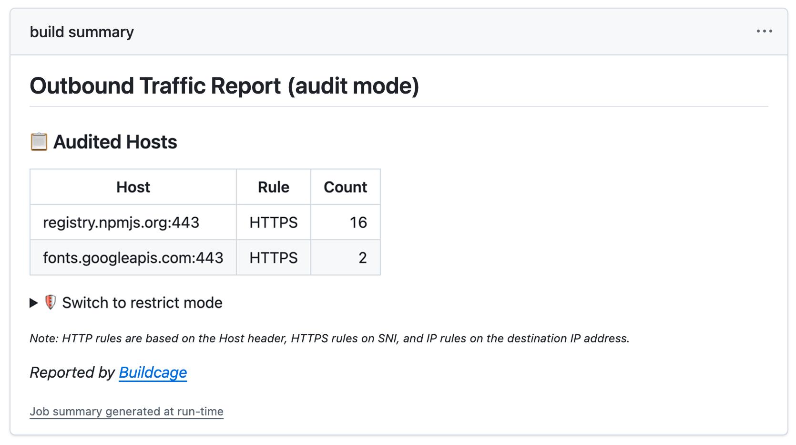
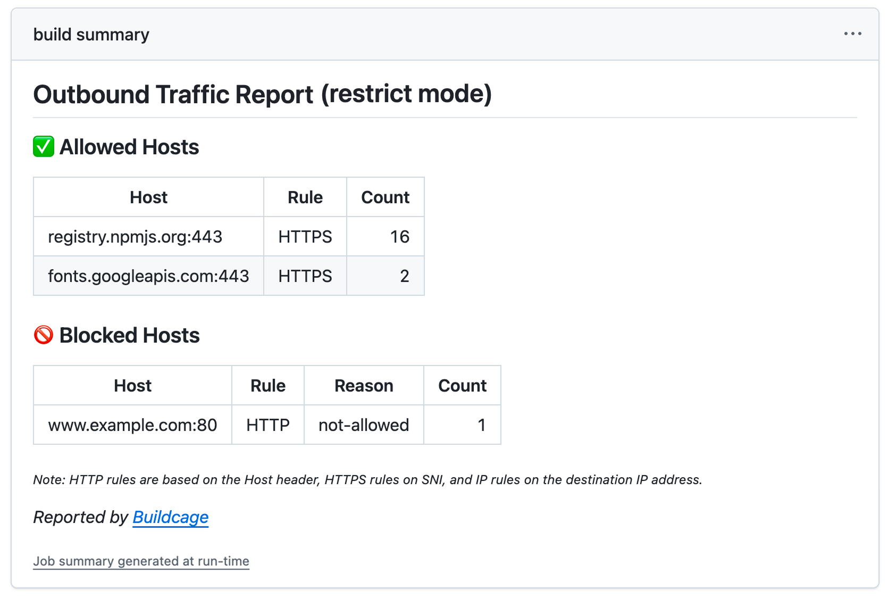

# Buildcage for `run:` Steps


[](https://github.com/buildcage/isolated-run)
[](https://github.com/marketplace/actions/buildcage-for-run-steps)


GitHub Action that restricts outbound network access for a workflow `run:` step to an allowlist of
domains. The command runs isolated directly on the runner, with no changes to the command itself,
no proxy configuration, and no certificates to install — it works with any language or package
manager. It keeps the same UID and `$HOME` as the rest of the job, so credentials, caches, and
toolchains set up by earlier steps keep working unmodified.

See [buildcage.github.io](https://buildcage.github.io/) for what it does and why. To isolate a
Docker build's `RUN` steps rather than a workflow step, use
[Buildcage for Docker](https://github.com/buildcage/docker).

## Contents

- [Usage](#usage)
- [Inputs](#inputs)
- [Operation modes](#operation-modes)
- [Rule syntax](#rule-syntax)
- [Passing values to `run`](#passing-values-to-run)
- [Filesystem access](#filesystem-access)
- [Scope](#scope)
- [Hardening](#hardening)
- [Documentation](#documentation)

## Usage

Wrap the command you want to isolate with this action instead of a plain `run:` step. Run once in
[`audit`](#operation-modes) mode to discover what the command reaches, then switch to `restrict`.

### 1. Discover what your command reaches

```yaml
- name: Discover required domains
  uses: buildcage/isolated-run@6c105ec20e59259bf0f6f3831397d25273f1c158 # v1.0.3
  with:
    proxy_mode: audit # Log every destination, block nothing
    run: |
      npm ci
      npm test
```

The step writes every destination the command contacted to the Job Summary:



Its **Switch to restrict mode** section contains the allowlist already filled in from those hosts.

### 2. Enforce the allowlist

```yaml
- name: Run tests with outbound network isolation
  uses: buildcage/isolated-run@6c105ec20e59259bf0f6f3831397d25273f1c158 # v1.0.3
  with:
    proxy_mode: restrict # Block every destination except the ones you allow
    allowed_https_rules: |
      registry.npmjs.org:443
    run: |
      npm ci
      npm test
```

Anything outside the allowlist is now blocked, and the step fails with the host named:



Complete workflows: [audit](.github/workflows/example-audit.yml) ·
[restrict](.github/workflows/example-restrict.yml).

### Notes

- Each step is self-contained: it starts its own throwaway proxy container, runs the command in the
  isolated sandbox, appends its report to the Job Summary, and stops the container again — all
  within that one step. Using this action several times in the same job gives each step its own
  allowlist. This holds even when the steps run concurrently via GitHub Actions'
  `background`/`wait`/`wait-all`/`parallel` keywords: the proxy container, network, and Compose
  project are namespaced by a per-step random suffix, so concurrent steps never tear down each
  other's containers. Use [`label`](#inputs) to tell their report sections apart.
- Private registries work like any other host: add the domain to `allowed_https_rules`.
- The isolated command **cannot use Docker** — the `docker` group is cleared before it runs, so even
  though the Docker socket is visible on the filesystem, the command has no permission to use it.
- HTTP and HTTPS have separate inputs — some package managers still download over plain HTTP
  (e.g. certain Debian mirrors), and those hosts go in `allowed_http_rules`:

  ```yaml
  allowed_http_rules: deb.debian.org:80
  allowed_https_rules: registry.npmjs.org:443
  ```

- One registry often needs several domains. PyPI, for example, uses both `pypi.org` and
  `files.pythonhosted.org` — the audit report lists every one of them, so start from that.

> [!NOTE]
> This action sets up its isolation directly on the runner host (via `sudo -n`), so it requires a
> Linux runner with passwordless `sudo` and a working Docker installation — both are the default on
> GitHub-hosted `ubuntu-*` runners, but lightweight images such as `ubuntu-slim` (a Docker client
> with no daemon) are not supported.

## Inputs

| Input                 | Required | Default    | Description                                                                                                                                                                   |
| --------------------- | -------- | ---------- | ----------------------------------------------------------------------------------------------------------------------------------------------------------------------------- |
| `run`                 | Yes      | —          | Command(s) to run inside the isolated sandbox (multi-line supported, like a workflow `run:` step)                                                                             |
| `proxy_mode`          | No       | `restrict` | Operation mode (`audit` / `restrict`, see [Operation modes](#operation-modes))                                                                                                |
| `allowed_https_rules` | No       | empty      | HTTPS allow rules (wildcard or regex, port required)                                                                                                                          |
| `allowed_http_rules`  | No       | empty      | HTTP allow rules (wildcard or regex, port required)                                                                                                                           |
| `allowed_ip_rules`    | No       | empty      | IP address allow rules (wildcard or regex, port required)                                                                                                                     |
| `fail_on_blocked`     | No       | `true`     | Fail the step if blocked connections are detected (restrict mode only; ignored in audit mode)                                                                                 |
| `known_blocked_rules` | No       | empty      | Domains expected to be blocked intentionally (wildcard or regex, port required); blocked connections matching these don't fail the step even when `fail_on_blocked` is `true` |
| `writable`            | No       | empty      | Additional writable directories (newline-separated), on top of `$GITHUB_WORKSPACE`, `$HOME`, `/tmp`, and `$RUNNER_TEMP` — see [Filesystem access](#filesystem-access)         |
| `label`               | No       | empty      | Label appended to this step's Job Summary heading, e.g. `npm ci` — useful to tell steps apart when this action is used more than once in the same job                         |

If some blocked connections are expected — a known-noisy dependency, or a domain you are
deliberately keeping off the allowlist to confirm it stays blocked — list them in
`known_blocked_rules`. When every blocked connection matches, the step no longer fails even with
`fail_on_blocked: true`, and a `::notice::` is emitted instead of `::error::`; any unmatched blocked
connection still fails the step.

## Operation modes

| `proxy_mode` | When to use                                                     | Behavior                                                                                        |
| ------------ | --------------------------------------------------------------- | ----------------------------------------------------------------------------------------------- |
| `audit`      | First-time setup, adding new dependencies, investigating issues | Allows all observable connections, logs every destination the command reaches                   |
| `restrict`   | Production workflows, security-critical environments            | Allows only destinations matching `allowed_*_rules`, blocks everything else, logs both outcomes |

If you forget a domain that the command needs, `restrict` blocks it and the step fails with the host
named, so run in `audit` first to collect the full list.

## Rule syntax

`allowed_https_rules`, `allowed_http_rules`, `allowed_ip_rules`, and `known_blocked_rules` all share
the syntax below. Rules are separated by whitespace — spaces, tabs, or newlines.

```yaml
# These are equivalent:
allowed_https_rules: "a.com:443 b.com:443"
allowed_https_rules: |
  a.com:443
  b.com:443
```

### Wildcards

| Pattern | Matches                                                     | Example                                                                  |
| ------- | ----------------------------------------------------------- | ------------------------------------------------------------------------ |
| `*`     | One or more characters **excluding** dots (single label)    | `*.example.com` matches `sub.example.com` but not `deep.sub.example.com` |
| `**`    | One or more characters **including** dots (multiple labels) | `**.example.com` matches `sub.example.com` and `deep.sub.example.com`    |
| `?`     | A single character excluding dots                           | `exampl?.com` matches `example.com`, `examplx.com`                       |

### Ports

A port is required on every rule.

| Rule                 | Matches                                                       |
| -------------------- | ------------------------------------------------------------- |
| `example.com:443`    | `example.com` on port 443 only                                |
| `*.example.com:8443` | Any single-level subdomain of `example.com` on port 8443 only |
| `example.com:*`      | `example.com` on any port                                     |

### IP addresses

Direct IP access bypasses DNS resolution, so it is handled separately: put those rules in
`allowed_ip_rules`. Only IPv4 is supported, and CIDR notation is not.

| Rule              | Matches                        |
| ----------------- | ------------------------------ |
| `192.168.1.1:443` | `192.168.1.1` on port 443 only |
| `10.0.0.1:8080`   | `10.0.0.1` on port 8080 only   |

### Regular expressions

Prefix a rule with `~` to use a regular expression, matched against `domain:port`. Include a port
pattern if you want to restrict by port — a range of addresses can be matched this way.

| Rule                             | Effect                                                     |
| -------------------------------- | ---------------------------------------------------------- |
| `~^example\.com:443$`            | Matches `example.com` on port 443 only                     |
| `~^example\.com:\d+$`            | Matches `example.com` on any port                          |
| `~^.*\.example\.com:{443,8443}$` | Matches any subdomain of `example.com` on port 443 or 8443 |
| `~^192\.168\.1\.\d+:80$`         | Matches a range of IP addresses (in `allowed_ip_rules`)    |

### Together

```yaml
- uses: buildcage/isolated-run@6c105ec20e59259bf0f6f3831397d25273f1c158 # v1.0.3
  with:
    proxy_mode: restrict

    allowed_https_rules: |
      registry.npmjs.org:443
      *.githubusercontent.com:443
      ~^.*\.example\.com:443$

    allowed_http_rules: |
      deb.debian.org:80

    allowed_ip_rules: |
      192.168.1.1:443

    run: |
      npm ci
      npm test
```

## Passing values to `run`

Use the step's own `env:` (not a `with:` input) to pass values into `run` — exactly like a native
`run:` step. The action forwards its whole process environment into the isolated command, so
anything set via `env:` is available there too:

```yaml
- uses: buildcage/isolated-run@6c105ec20e59259bf0f6f3831397d25273f1c158 # v1.0.3
  env:
    PR_TITLE: ${{ github.event.pull_request.title }}
  with:
    run: |
      echo "Building for: $PR_TITLE"
      npm test
```

Avoid interpolating `${{ }}` expressions directly into `run` itself (e.g.
`run: echo "${{ github.event.pull_request.title }}"`) — GitHub substitutes them into the script text
before any shell runs, so an attacker-controlled value (a PR title, branch name, issue body, etc.)
can inject arbitrary commands. Passing the same value through `env:` instead means it reaches the
isolated command as a single environment variable, never interpreted as shell syntax. This is the
same
[script injection guidance](https://docs.github.com/en/actions/security-guides/security-hardening-for-github-actions#understanding-the-risk-of-script-injections)
GitHub gives for any workflow, and applies to this action's `run` input exactly as it would to a
native `run:` step.

## Filesystem access

Only `$GITHUB_WORKSPACE`, `$HOME`, `/tmp`, and `$RUNNER_TEMP` are writable by default — every other
path is remounted read-only for the duration of the `run` command. This closes off using the
filesystem to plant a payload for a later, non-sandboxed step in the same job (e.g. rewriting a
binary earlier on `$PATH`); it doesn't restrict what the command can _read_ (see
[Known Limitations](./docs/security.md#known-limitations)).

If `run` needs to write somewhere else — a tool-specific cache directory, for example — list it
under `writable`:

```yaml
- uses: buildcage/isolated-run@6c105ec20e59259bf0f6f3831397d25273f1c158 # v1.0.3
  with:
    writable: |
      /opt/some-tool/cache
    run: some-tool build
```

To disable the read-only restriction entirely, set `writable` to `/`:

```yaml
writable: /
```

## Scope

Buildcage controls _where_ your command can connect, not _what code_ it runs. A malicious package
delivered through an allowed domain still runs. Use it as one layer in a defense-in-depth strategy —
a last line of defense so that if something slips through your other measures, at least it can't
call home. See [Security Details](./docs/security.md) for the full threat model.

## Hardening

An allowlist works on domain names, so it cannot stop anything leaving through a service you had to
allow anyway. That is a structural limit. What it does stop is traffic to a destination that is not
on the list, and infrastructure an attacker set up is normally not on it, because the command has no
reason to reach it. That is also the hardest kind of leak to find afterwards.

Buildcage runs against the command you already have, and an allowlist generated from an audit run
already blocks every destination the audit did not record. Whether to go further depends on what the
step has access to. [Hardening](./docs/security.md#hardening) is what to look at when it holds
credentials, personal data, or source you do not publish.

## Documentation

| Doc                                          | What's in it                                                |
| -------------------------------------------- | ----------------------------------------------------------- |
| [Security Details](./docs/security.md)       | Architecture, attack resistance, and known limitations      |
| [Self-Hosting Guide](./docs/self-hosting.md) | Hosting your own isolated-run image in a private repository |
| [Development Guide](./docs/development.md)   | Local usage, testing, logs, and implementation internals    |

## Contributing

Contributions are welcome! Please feel free to submit issues or pull requests at
[github.com/buildcage/isolated-run](https://github.com/buildcage/isolated-run).

## Show Your Support

If you find this action helpful, please consider giving it a star ⭐ on GitHub!

## Disclaimer

This software is provided "as is", without warranty of any kind, express or implied. The authors
and contributors are not liable for any damages, losses, or security incidents arising from the
use of this software. Use at your own risk.

## License

The isolated-run source code is licensed under the MIT License. See [LICENSE](./LICENSE) file for
details.

The Docker image includes third-party components under their own licenses (GPL, Apache 2.0, ISC,
etc.). See [THIRD_PARTY_LICENSES](./THIRD_PARTY_LICENSES) for the full list.
