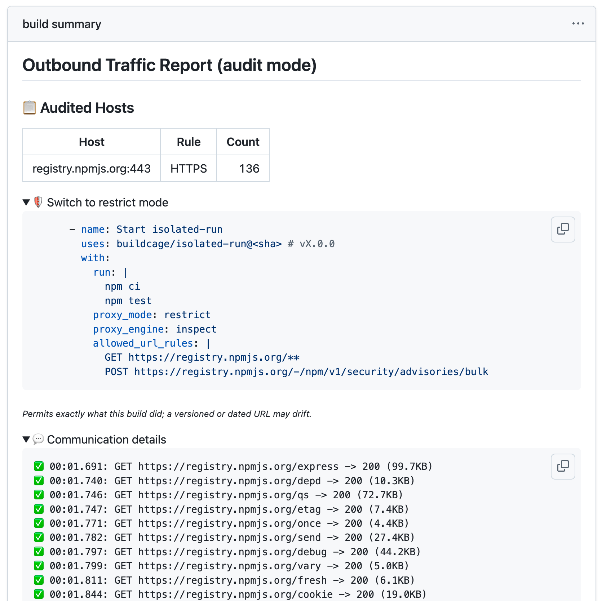
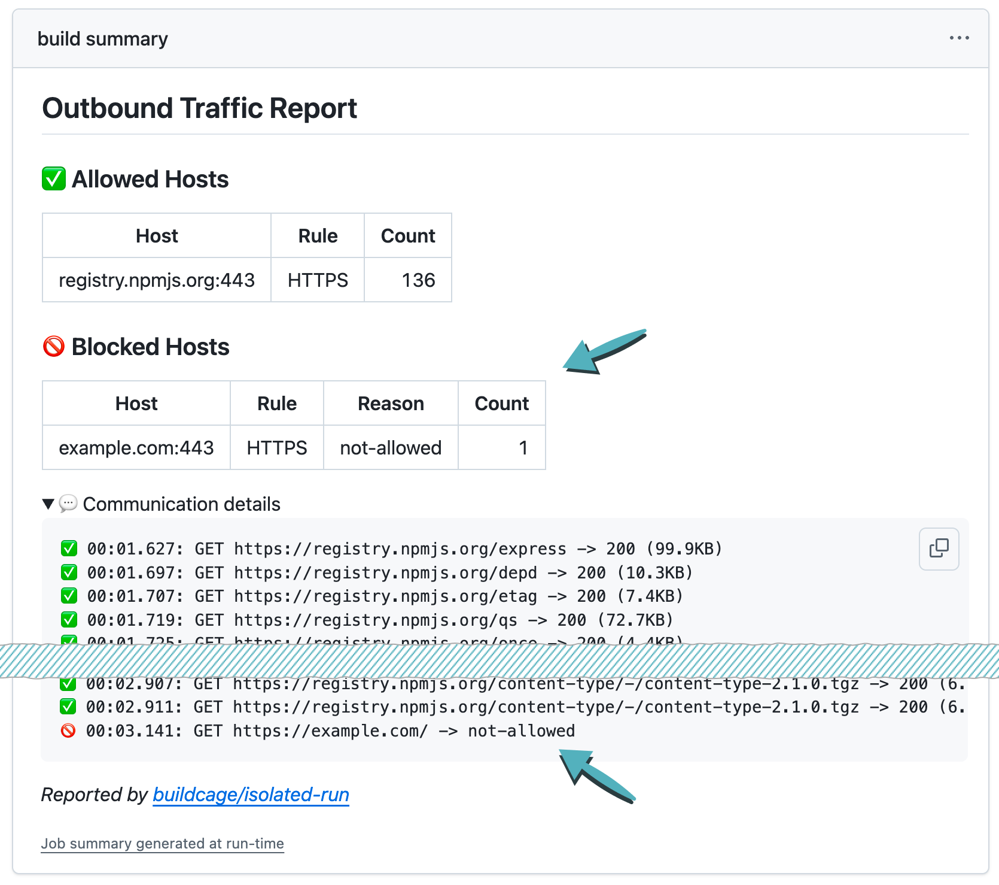

# Buildcage for `run:` Steps


[](https://github.com/buildcage/isolated-run)
[](https://github.com/marketplace/actions/buildcage-for-run-steps)


GitHub Action that restricts where a workflow `run:` step can connect. The command runs isolated on
the runner behind an allowlist you write by HTTP method and URL, not only by hostname, so a step can
be allowed to fetch a package from a registry without being allowed to publish one to it.

The command itself does not change: no proxy to configure, no certificate to install, and the same
UID and `$HOME` as the rest of the job, so credentials, caches, and toolchains set up by earlier
steps keep working. Run once in [`audit`](#operation-modes) mode and the report hands you the
allowlist to paste back in. Everything runs inside your GitHub Actions job: no agent, no external
service.

See [buildcage.github.io](https://buildcage.github.io/) for what it does and why. To isolate a
Docker build's `RUN` steps rather than a workflow step, use
[Buildcage for Docker](https://github.com/buildcage/docker).

## Contents

- [Usage](#usage)
- [Inputs](#inputs)
- [Operation modes](#operation-modes)
- [Rule syntax](#rule-syntax)
- [Engines](#engines)
- [CA trust and compatibility](#ca-trust-and-compatibility)
- [The report](#the-report)
- [Passing values to `run`](#passing-values-to-run)
- [Filesystem access](#filesystem-access)
- [Scope](#scope)
- [Documentation](#documentation)

## Usage

Wrap the command you want to isolate with this action instead of a plain `run:` step. Run once in
[`audit`](#operation-modes) mode to collect what the command reaches, then switch to `restrict`.

Two engines decide how closely that traffic is examined:

- **`inspect`** terminates TLS and reads the request, so a rule can name a method and a URL. It
  mounts a CA into the sandbox's own view of the filesystem; nothing is written to the runner.
- **`universal`** never decrypts, so it also works where a CA cannot be used, such as a tool that
  pins a certificate. Not decrypting means a rule reaches only as far as a host and a port.

The steps below use `inspect`. [Engines](#engines) compares the two in full.

### 1. Find out what the command reaches

```yaml
- name: Discover what the command reaches
  uses: buildcage/isolated-run@eb076226d15bbadefb7545dc1e02c05ff9f09ae5 # v1.1.3
  with:
    proxy_mode: audit # Log every destination, block nothing
    proxy_engine: inspect # Record the method and URL of every request
    run: |
      npm ci
      npm test
```

The step writes every destination the command contacted to the Job Summary:



Its **Switch to restrict mode** section holds the allowlist, already written out from what the
command actually did.

### 2. Enforce the allowlist

Paste that allowlist into the step and switch the mode:

```yaml
- name: Run tests with outbound network isolation
  uses: buildcage/isolated-run@eb076226d15bbadefb7545dc1e02c05ff9f09ae5 # v1.1.3
  with:
    proxy_mode: restrict
    proxy_engine: inspect
    allowed_url_rules: |
      GET https://registry.npmjs.org/**
      POST https://registry.npmjs.org/-/npm/v1/security/advisories/bulk
    run: |
      npm ci
      npm test
```

Each rule names the methods it permits, so these let npm install packages without letting it publish
any: `npm publish` is a `PUT` to the same host, which no rule here covers. Whatever is refused is
listed under **Blocked Hosts** with the reason, and **Communication details** names the full URL of
every request, allowed or refused:



A blocked connection fails the step, so a command that starts reaching somewhere new doesn't pass
unnoticed. Set `fail_on_blocked: false` to report without failing, or list destinations you expect to
stay blocked in `known_blocked_rules`.

Nothing about the command changes. The CA it has to trust is mounted into the sandbox's own view of
the filesystem, so the command sees an ordinary HTTPS connection.

### Example workflows

Each pair runs the same command with and without rules:
`inspect` on an npm and pip install ([audit](.github/workflows/example-inspect-audit.yml) ·
[restrict](.github/workflows/example-inspect-restrict.yml)), `universal` on a Maven build
([audit](.github/workflows/example-universal-audit.yml) ·
[restrict](.github/workflows/example-universal-restrict.yml)).

### Notes

- Each step is self-contained: it starts its own throwaway proxy container, runs the command in the
  isolated sandbox, appends its report to the Job Summary, and stops the container again, all within
  that one step. Using this action several times in the same job gives each step its own allowlist.
  This holds even when the steps run concurrently via GitHub Actions'
  `background`/`wait`/`wait-all`/`parallel` keywords: the proxy container, network, and Compose
  project are namespaced by a per-step random suffix, so concurrent steps never tear down each
  other's containers. Use [`label`](#inputs) to tell their report sections apart.
- Private registries are ordinary hosts: add the domain like any other.
- The isolated command **cannot use Docker**. If `docker` (or another container/VM runtime group)
  is the runner's primary group, it's substituted for a safe one before the command runs; the
  runtime sockets themselves are also masked. See [Isolation Mechanisms](docs/security.md#isolation-mechanisms)
  in the Security doc for both layers.
- One registry often needs several domains. PyPI, for example, uses both `pypi.org` and
  `files.pythonhosted.org`. The audit report lists every one of them, so start from that.
- The generated allowlist covers only what the engine decrypted. `allow_tls_rules` and
  `allowed_ip_rules` come back exactly as the audit run was configured with them.
- If something the command runs pins a certificate or carries its own trust store (the JVM is the
  usual case), use `proxy_engine: universal` instead. See [Engines](#engines).

> [!NOTE]
> This action sets up its isolation directly on the runner host (via `sudo -n`), so it requires a
> Linux runner with passwordless `sudo` and a working Docker installation. Both are the default on
> GitHub-hosted `ubuntu-*` runners, but lightweight images such as `ubuntu-slim` (a Docker client
> with no daemon) are not supported.

## Inputs

`run` is the only required input.

| Input                             | Default      | Description                                                                                                      |
| --------------------------------- | ------------ | ---------------------------------------------------------------------------------------------------------------- |
| `run`                             | required     | Command(s) to run inside the isolated sandbox, multi-line like a workflow `run:` step                            |
| `proxy_mode`                      | `restrict`   | `audit` or `restrict`. See [Operation modes](#operation-modes).                                                  |
| `proxy_engine`                    | `universal`  | `inspect` or `universal`. See [Engines](#engines).                                                               |
| `fail_on_blocked`                 | `true`       | Fail the step when a connection was blocked (restrict mode only; ignored in audit mode)                          |
| `writable`                        | empty        | Directories the command may write to, beyond the defaults. See [Filesystem access](#filesystem-access).          |
| `filesystem`                      | `persistent` | `persistent` or `ephemeral` (**experimental**). See [Filesystem access](#filesystem-access).                     |
| `allow_write`                     | empty        | `filesystem: ephemeral` only: paths to keep writable and persisted. See [Filesystem access](#filesystem-access). |
| `label`                           | empty        | Label appended to this step's Job Summary heading, e.g. `npm ci`, to tell repeated steps apart                   |
| `upload_traffic_artifact`         | `false`      | Upload the observed traffic as a JSON artifact, `inspect` only. See [The report](#the-report).                   |
| `traffic_artifact_retention_days` | empty        | How long to keep that artifact, in days; empty uses the repository's own default                                 |

### Rule inputs

All of these are empty by default. Which ones apply depends on the engine:

| Input                 | `inspect` | `universal` | What one rule matches                                                               |
| --------------------- | :-------: | :---------: | ----------------------------------------------------------------------------------- |
| `allowed_url_rules`   |    ✅     |      -      | A method and a URL: `GET https://registry.npmjs.org/**`                             |
| `allowed_https_rules` |    ✅     |     ✅      | A host and port reached over HTTPS: `registry.npmjs.org:443`                        |
| `allowed_http_rules`  |    ✅     |     ✅      | A host and port reached over plain HTTP: `deb.debian.org:80`                        |
| `allowed_ip_rules`    |    ✅     |     ✅      | An address and port, for connections made without DNS: `192.168.1.1:443`            |
| `allow_tls_rules`     |    ✅     |      -      | A TLS destination to pass through undecrypted, judged on SNI: `db.example.com:5432` |
| `known_blocked_rules` |    ✅     |     ✅      | A host expected to be blocked, so it doesn't fail the step                          |

Setting a rule the engine can't act on is caught before the command starts: `restrict` fails, since
a rule that looks like it protects the step but cannot be enforced is worse than none, and `audit`
warns and ignores it.

If some blocked connections are expected, say a known-noisy dependency, or a domain you are
deliberately keeping off the allowlist to confirm it stays blocked, list them in
`known_blocked_rules`. When every blocked connection matches, the step no longer fails even with
`fail_on_blocked: true`, and a `::notice::` is emitted instead of `::error::`; any unmatched blocked
connection still fails the step.

See [Rule syntax](#rule-syntax) for the grammar.

## Operation modes

| `proxy_mode` | What it does                                                      | When to use it                                            |
| ------------ | ----------------------------------------------------------------- | --------------------------------------------------------- |
| `audit`      | Logs every destination the command reaches and blocks nothing     | First setup, adding a dependency, investigating a failure |
| `restrict`   | Allows only what the rules match, blocks and logs everything else | Everyday workflows, security-critical steps               |

If you forget a domain the command needs, `restrict` blocks it and the step fails with the
destination named, which is why it is worth running `audit` first.

Under `inspect`, `audit` is not a passive observer: TLS is still terminated, so a tool that pins a
certificate fails there exactly as it would under `restrict`. `universal`'s audit mode decrypts
nothing and breaks nothing.

## Rule syntax

`allowed_url_rules` and `allow_tls_rules` need `proxy_engine: inspect`. The host rules work with
either engine. The inputs are additive: a connection is allowed when any rule in any of them
matches.

### URL rules: `allowed_url_rules`

A rule is a method list, a space, then a URL pattern. Because a rule contains a space, this input is
newline-separated. The method is required, so a rule always states what it permits. A blank line, or
a line starting with `#`, is ignored, which helps once the list gets long.

```yaml
allowed_url_rules: |
  # npm installs
  GET https://registry.npmjs.org/@myorg/**
  GET|HEAD https://example.com/public/*

  # internal write access
  POST,PUT https://api.internal.example.com/v1/*
  * https://internal.example.com
```

Methods are separated by `|` or `,`, and `*` means any method. The port may be left out when it is
the scheme's default, and a pattern with no path allows any path on that host.

| Pattern | In a domain                                       | In a path                     |
| ------- | ------------------------------------------------- | ----------------------------- |
| `**`    | crosses dots                                      | crosses `/`                   |
| `*`     | one or more, not crossing a dot                   | one or more, not crossing `/` |
| `?`     | one character                                     | one character                 |
| `~`     | raw regex, split into a host half and a path half |                               |

A `~` rule is split at the first `/` after `://` rather than applied to the whole URL: everything
before that `/` is matched against the host, everything from it onward against the path. So
`~^https://example\.com/pub/.*$` becomes a host match on `example\.com` and a path match on
`/pub/.*$`. The host half's port pattern can be any regex (`example\.com:(443|8443)`,
`example\.com:\d+`), matched against the connection's own `host:port`. Leave it out and the rule
matches the scheme's default port only, 443 for `https` and 80 for `http`; there is no implicit
any-port, so write `example\.com:.*` to allow more.

A wildcard may sit among literal text, in a domain label or a path segment: `abc*.amazonaws.com`,
`/pkg-*/**`. A path or method never narrows what a wildcard _host_ resolves. See
[Inspect Proxy Engine](./docs/security.md#inspect-proxy-engine) for why, and for how to write a host
pattern that doesn't widen more than intended.

A rule may name an address rather than a name. Nothing is loosened by that: the rules still match
against the `Host` header and still decide, and an address reached this way stays inspected, so
method and path rules apply to it. Over HTTPS the origin's certificate has to be valid for the
address, which needs an IP SAN, so in practice an address is a plaintext or a passthrough
destination.

### Host rules: `allowed_https_rules`, `allowed_http_rules`, `allowed_ip_rules`, `known_blocked_rules`

These four share one syntax. Rules are separated by whitespace, so one per line reads best. A host
rule is equivalent to a URL rule with any method and any path.

#### Wildcards

| Pattern | Matches                                                     | Example                                                                  |
| ------- | ----------------------------------------------------------- | ------------------------------------------------------------------------ |
| `*`     | One or more characters **excluding** dots (single label)    | `*.example.com` matches `sub.example.com` but not `deep.sub.example.com` |
| `**`    | One or more characters **including** dots (multiple labels) | `**.example.com` matches `sub.example.com` and `deep.sub.example.com`    |
| `?`     | A single character excluding dots                           | `exampl?.com` matches `example.com`, `examplx.com`                       |

A label that contains `*` has to be exactly `*` or `**`. `abc*.example.com` is rejected here; only
`allowed_url_rules` takes a wildcard in the middle of a label.

#### Ports

A port is required on every rule.

| Rule                 | Matches                                                       |
| -------------------- | ------------------------------------------------------------- |
| `example.com:443`    | `example.com` on port 443 only                                |
| `*.example.com:8443` | Any single-level subdomain of `example.com` on port 8443 only |
| `example.com:*`      | `example.com` on any port                                     |

### IP addresses: `allowed_ip_rules`

Connections made straight to an address never go through DNS, so they are allowed separately from
any domain. IPv4 only, and what a rule may hold depends on the engine:

| Engine      | A rule can be                                               | It cannot be       |
| ----------- | ----------------------------------------------------------- | ------------------ |
| `inspect`   | An address, a CIDR block (`10.0.0.0/8:443`), or a `~` regex | A wildcard pattern |
| `universal` | An address, a wildcard, or a `~` regex                      | A CIDR block       |

Either way the connection is tunnelled without inspection: once an `ip:port` pair is allowed, any
TCP-based protocol can use that path. Prefer a domain rule where the destination has a stable name.

### TLS passthrough: `allow_tls_rules`

For TLS traffic that isn't HTTPS. The SNI and port are checked and the connection passes through
undecrypted, so the command validates the origin's own certificate. The name is still resolved by
the proxy, so a passthrough goes where the proxy resolved it and not where the command aimed:

```yaml
allow_tls_rules: |
  db.example.com:5432
```

### Regular expressions

Prefix a rule with `~` to use a regular expression. A host rule's pattern is matched against
`domain:port` as one expression, so the port is part of the pattern and can be a regex itself. It
cannot be left out: either engine refuses a `~` host rule with no `:` in it, since what the pattern
is matched against always carries the port.

| Rule                              | Effect                                                     |
| --------------------------------- | ---------------------------------------------------------- |
| `~^example\.com:443$`             | Matches `example.com` on port 443 only                     |
| `~^example\.com:\d+$`             | Matches `example.com` on any port                          |
| `~^.*\.example\.com:(443\|8443)$` | Matches any subdomain of `example.com` on port 443 or 8443 |
| `~^192\.168\.1\.\d+:80$`          | Matches a range of IP addresses (in `allowed_ip_rules`)    |

In `allowed_url_rules` a `~` expression covers the URL, and is split into a host half and a path
half as described above. A rule the split cannot handle, one with no `/` after `://`, is refused
with an error naming what to write instead.

## Engines

`proxy_engine` selects how Buildcage sees the command's traffic.

|                                               | `inspect`<br>terminates TLS, checks method and URL         | `universal`<br>reads the SNI only, checks host and port |
| --------------------------------------------- | ---------------------------------------------------------- | ------------------------------------------------------- |
| A rule can say                                | `GET\|HEAD https://registry.npmjs.org/**`                  | `registry.npmjs.org:443`                                |
| Allow a fetch, refuse a publish, same host    | ✅                                                         | -                                                       |
| The report shows                              | Every request with its full URL                            | Host and port                                           |
| Domain fronting (allowed SNI, another `Host`) | Refused, the real `Host` is what rules match               | Not visible                                             |
| The command's TLS                             | Terminated and re-signed with a CA generated for that step | Untouched                                               |
| Certificate pinning, or the JVM's own store   | -                                                          | ✅                                                      |
| Traffic as a JSON artifact                    | ✅                                                         | -                                                       |

Both intercept at the network level, so a tool that ignores `HTTP_PROXY` is covered either way, and
both use the same sandbox and the same network boundary.

Start with `inspect`, and fall back to `universal` when something the command runs won't accept the
mounted CA; see [CA trust and compatibility](#ca-trust-and-compatibility). `universal` is the default
value of `proxy_engine`, so `inspect` has to be set explicitly. `transparent` is accepted as an alias
for `universal`, the name it had before `inspect` existed.

For the architecture and threat model behind each engine, see
[Security Details](./docs/security.md). For implementation internals, see the
[Development Guide](./docs/development.md).

## CA trust and compatibility

This section is about `proxy_engine: inspect`, which terminates TLS and re-signs it with a CA
generated for the step, so the command has to trust that CA. The CA, and where relevant an augmented
copy of the system CA store, is mounted over the sandbox's own view of those paths. Nothing is
written to the runner's filesystem, and the mount goes away with the sandbox when the step ends.

The variables below are set only when the command's environment leaves them unset, and where each
one points depends on what it means to the tool that reads it:

| Variable              | Read by                                                                                                 | If unset                                         |
| --------------------- | ------------------------------------------------------------------------------------------------------- | ------------------------------------------------ |
| `NODE_EXTRA_CA_CERTS` | Node.js                                                                                                 | Additive: pointed at a file holding only this CA |
| `DENO_CERT`           | Deno                                                                                                    | Additive: pointed at a file holding only this CA |
| `CURL_CA_BUNDLE`      | curl                                                                                                    | Left unset; curl already reads the system store  |
| `REQUESTS_CA_BUNDLE`  | Python `requests`                                                                                       | Replaces the bundle: pointed at the system store |
| `PIP_CERT`            | pip                                                                                                     | Replaces the bundle: pointed at the system store |
| `SSL_CERT_FILE`       | OpenSSL, and anything reading it (Go's `crypto/x509` on Unix, Ruby, wget, Rust's `rustls-native-certs`) | Replaces the bundle: pointed at the system store |

**A variable that is already set is left alone**, not appended to. Appending safely would mean
resolving the path it points at against the sandbox rootfs without following a symlink back out to
the host, which this engine does not do yet.

**The CA is added to a store that already exists, it is not created.** A step whose filesystem has
nothing resembling a system CA bundle at a well-known path has nothing for this action to add to.
That only matters to a tool that needs TLS trust for something.

**Not supported under `inspect`:** a tool that pins a certificate, or ships its own trust store
instead of reading the variables above. The JVM (Java, Kotlin, Scala) is the common case, since it
only reads its own `cacerts` file. Use `proxy_engine: universal` for those.

See [Inspect Proxy Engine](./docs/security.md#inspect-proxy-engine) for the threat model and
attack resistance.

## The report

Every step appends its own section to the Job Summary: the hosts it reached, the ones it was
refused, and, in `audit`, the allowlist to switch to `restrict` with. Under `inspect` a
**Communication details** section lists every request in order with its method, full URL, status and
size, refusals included, so a blocked entry names the exact URL that was attempted rather than a
bare host. Use [`label`](#inputs) to tell several steps' sections apart.

GitHub caps a Job Summary at 1 MiB per step and drops the whole summary rather than truncating it,
so if the timeline would push the step over that limit, that section alone is cut at a line
boundary and a note takes its place. The workflow run's own logs carry no such limit and are never
cut.

### Traffic artifact

`upload_traffic_artifact: true` uploads the same timeline as a `traffic.json` inside an artifact
named `buildcage-traffic-<id>`, where `<id>` is this step's own container suffix so several steps in
one job never collide. It carries name lookups that only resolved as well, which is how a too-wide
rule being probed shows up. `universal` never sees a method or a URL, so this input only does
anything under `inspect`.

| Field         | Always | Notes                                                  |
| ------------- | ------ | ------------------------------------------------------ |
| `time`        | yes    | ISO 8601 UTC                                           |
| `elapsed`     |        | since the proxy started, fixed `HH:MM:SS.mmm`          |
| `action`      | yes    | `allow`, `block`, or `audit` when nothing was enforced |
| `protocol`    | yes    | `https`, `http`, `tls`, `tcp`, `dns`                   |
| `host`        | yes    | the name asked for, or the address when there was none |
| `port`        |        | absent for `dns`, which connects to nothing            |
| `method`      |        | `http` and `https` only                                |
| `url`         |        | `http` and `https` only                                |
| `status`      |        | only when something answered                           |
| `bytes`       |        | absent for a refusal and for `dns`                     |
| `reason`      |        | only when `action` is `block`                          |
| `destination` |        | the address it actually resolved to; absent for `dns`  |

A field is absent because it does not apply, never because it was zero: a refusal has no status
because nothing answered, and a passthrough none because nothing was decrypted. Filter on `action`.
The artifact is uploaded even when the step fails, since a failing run is when it is most wanted.

```json
[
  {
    "time": "2026-09-02T04:11:07.512Z",
    "elapsed": "00:00:00.512",
    "action": "allow",
    "protocol": "https",
    "host": "registry.npmjs.org",
    "port": 443,
    "method": "GET",
    "url": "https://registry.npmjs.org/express",
    "status": 200,
    "bytes": 102300,
    "destination": "104.16.0.35"
  },
  {
    "time": "2026-09-02T04:11:08.048Z",
    "elapsed": "00:00:01.048",
    "action": "block",
    "protocol": "dns",
    "host": "secret-data.attacker.example",
    "reason": "dns-not-allowed"
  },
  {
    "time": "2026-09-02T04:11:08.390Z",
    "elapsed": "00:00:01.390",
    "action": "block",
    "protocol": "https",
    "host": "registry.npmjs.org",
    "port": 443,
    "method": "POST",
    "url": "https://registry.npmjs.org/express/-rev/1-abc",
    "reason": "not-allowed"
  }
]
```

## Passing values to `run`

Use the step's own `env:` (not a `with:` input) to pass values into `run`, exactly like a native
`run:` step. The action forwards its whole process environment into the isolated command, so
anything set via `env:` is available there too:

```yaml
- uses: buildcage/isolated-run@eb076226d15bbadefb7545dc1e02c05ff9f09ae5 # v1.1.3
  env:
    PR_TITLE: ${{ github.event.pull_request.title }}
  with:
    run: |
      echo "Building for: $PR_TITLE"
      npm test
```

Avoid interpolating `${{ }}` expressions directly into `run` itself (e.g.
`run: echo "${{ github.event.pull_request.title }}"`). GitHub substitutes them into the script text
before any shell runs, so an attacker-controlled value (a PR title, branch name, issue body) can
inject arbitrary commands. Passing the same value through `env:` instead means it reaches the
isolated command as a single environment variable, never interpreted as shell syntax. This is the
same
[script injection guidance](https://docs.github.com/en/actions/security-guides/security-hardening-for-github-actions#understanding-the-risk-of-script-injections)
GitHub gives for any workflow, and applies to this action's `run` input exactly as it would to a
native `run:` step.

## Filesystem access

Only `$GITHUB_WORKSPACE`, `$HOME`, `/tmp`, and `$RUNNER_TEMP` are writable by default. Every other
path is remounted read-only for the duration of the `run` command, which closes off planting a
payload anywhere outside those four paths. It doesn't close off planting one inside them: `$HOME`
and `$RUNNER_TEMP` stay writable, and `GITHUB_ENV`/`GITHUB_PATH`/`GITHUB_OUTPUT` live under
`$RUNNER_TEMP`, so a later, non-isolated step in the same job can still pick up whatever the command
left there. See `filesystem: ephemeral` below, and
[Known Limitations](./docs/security.md#known-limitations) for what neither mode closes off. It also
doesn't restrict what the command can _read_.

`filesystem` controls what happens to those writes once the step ends:

| `filesystem`               | What it does                                                                                                                                                      |
| -------------------------- | ----------------------------------------------------------------------------------------------------------------------------------------------------------------- |
| `persistent` (default)     | Writes to `$GITHUB_WORKSPACE`/`$HOME`/`/tmp`/`$RUNNER_TEMP` stay on the host after the step ends, exactly as today. `writable:` adds further writable paths.      |
| `ephemeral` (experimental) | Only paths listed in `allow_write:` persist; every other writable path is discarded when the step ends (via an overlay). `writable:` has no meaning in this mode. |

> [!WARNING]
> `filesystem: ephemeral` is **experimental**: its behavior, inputs, and error messages may still
> change in a future release without following semver, and it has seen less real-world use than the
> rest of this action. `persistent` (the default) is unaffected and stays stable. Try `ephemeral` in
> a non-critical workflow first, and pin this action to a commit SHA rather than a version tag if you
> adopt it.

Use `filesystem: ephemeral` when the command is untrusted and you want to stop it from planting
something a later, non-isolated step in the same job would pick up: a rewritten `~/.bashrc`,
`~/.npmrc`, `~/.docker/config.json`, or a `$GITHUB_ENV`/`$GITHUB_PATH`/`$GITHUB_OUTPUT` edit meant
to run code once the sandbox is gone.

```yaml
- uses: buildcage/isolated-run@eb076226d15bbadefb7545dc1e02c05ff9f09ae5 # v1.1.3
  with:
    filesystem: ephemeral
    allow_write: |
      $GITHUB_WORKSPACE
      $GITHUB_OUTPUT
      ./dist
    run: npm ci && npm run build && npm test
```

`filesystem: ephemeral` and `writable:` are mutually exclusive (this includes `writable: /`, which
has no meaning here); `allow_write:` is rejected outside `filesystem: ephemeral`.

This still doesn't close the delayed-exfiltration path off completely: `$GITHUB_WORKSPACE` has to
persist for the job to do anything with it, and a later step routinely runs whatever ends up there,
so `allow_write: $GITHUB_WORKSPACE` is effectively required for any real build and is exactly as
exposed to this as `persistent` mode is. What `ephemeral` mode actually buys you is closing off
everything else: `$HOME`, `$RUNNER_TEMP`, and the runner's own generated files unless you name them
explicitly.

`allow_write:` entries resolve like this:

- `$NAME` / `${NAME}` expand only for `HOME`, `GITHUB_WORKSPACE`, `RUNNER_TEMP`, `GITHUB_OUTPUT`,
  `GITHUB_ENV`, `GITHUB_PATH`, and `GITHUB_STEP_SUMMARY`, not arbitrary env, so a value smuggled in
  through the step's own `env:` block can't redirect where a listed path resolves. Any other `$NAME`
  is rejected.
- A leading `~/` expands to `$HOME`.
- A relative path (`./dist`) resolves against `$GITHUB_WORKSPACE`, matching the sandbox's own
  working directory.
- A path that doesn't already exist is created before the step runs, **always as a directory**,
  the same convention Docker itself uses for a bind mount whose host source doesn't exist yet
  (`docker run -v`/`--mount`), never as a file. `$GITHUB_OUTPUT`, `$GITHUB_ENV`, `$GITHUB_PATH`, and
  `$GITHUB_STEP_SUMMARY` are the runner's own generated files and must already exist: a missing one
  is an error, not something this action creates. Anything else missing (`./dist`, say) is created
  for you as a directory, with the same owner and permissions as its nearest already-existing parent
  directory: a path under a tree the runner already owns becomes writable, same as today, but a path
  under a tree it doesn't own (`/etc/something`, for instance) is created yet stays exactly as
  unwritable to the sandboxed command as naming that existing parent directly would be. Nothing here
  grants access beyond what the surrounding filesystem already implies.
- `allow_write:` accepts files as well as directories, but only a path that's **already** a file
  when the step starts; a missing target is always created as a directory (see above), never a file.
  A file entry is bind-mounted file-to-file (the same technique the `inspect` engine already uses to
  distribute its CA), so an append or a truncating write goes through, but a tool that replaces the
  file outright (`mv`, or unlink plus recreate) does not. `$GITHUB_OUTPUT` and `$GITHUB_STEP_SUMMARY`'s
  own contract is append-only, so this doesn't affect them in practice. If you need a file that
  doesn't exist yet to persist, either have an earlier step create it first, or list its
  (already-existing) parent directory instead.

If you `allow_write: $GITHUB_OUTPUT`, treat every output it sets the same as any other value from
untrusted code: never interpolate `${{ steps.<id>.outputs.<name> }}` directly into a later `run:`
block (see [Passing values to run](#passing-values-to-run) above), since it came from the
sandboxed command. `allow_write: $GITHUB_STEP_SUMMARY` lets the sandboxed command append to the Job Summary
directly; this action's own report is written to the same file, so anything the command adds appears
alongside it, not in place of it.

If `run` needs to write somewhere else in `persistent` mode, a tool-specific cache directory for
example, list it under `writable`:

```yaml
- uses: buildcage/isolated-run@eb076226d15bbadefb7545dc1e02c05ff9f09ae5 # v1.1.3
  with:
    writable: |
      /opt/some-tool/cache
    run: some-tool build
```

To disable the read-only restriction entirely in `persistent` mode, set `writable` to `/`:

```yaml
writable: /
```

## Scope

Buildcage controls _where_ your command can connect, not _what code_ it runs. A malicious package
delivered through an allowed domain still runs. Treat it as one layer in a defense-in-depth
strategy, a last line of defense so that if something slips through your other measures, at least it
can't call home.

This action isolates the step it wraps, not the job. What the command sets in `$GITHUB_ENV`,
`$GITHUB_PATH`, or an output reaches later steps unchanged, and so does anything it writes under
`$HOME`, `/tmp`, `$RUNNER_TEMP`, or `$GITHUB_WORKSPACE`. Those steps run without this action's
restrictions unless you wrap them too. If a step runs untrusted code, isolate the steps after it in
the same job as well, or move them to a separate job, and don't treat an env var, `$PATH` entry, or
output an isolated step set as trustworthy.

An allowlist also cannot stop anything leaving through a service you had to allow anyway. That is a
structural limit. What it does stop is traffic to a destination that is not on the list, and
infrastructure an attacker set up is normally not on it, because the command has no reason to reach
it. That is also the hardest kind of leak to find afterwards.

An allowlist generated from an audit run already blocks every destination the audit did not record.
Whether to go further depends on what the step has access to:
[Hardening](./docs/security.md#hardening) is what to look at when it holds credentials, personal
data, or source you do not publish. For the full threat model, see
[Security Details](./docs/security.md).

## Documentation

| Doc                                        | What's in it                                                      |
| ------------------------------------------ | ----------------------------------------------------------------- |
| [Security Details](./docs/security.md)     | Architecture and threat model for every engine, attack resistance |
| [Development Guide](./docs/development.md) | Local usage, testing, logs, and implementation internals          |

## Contributing

Contributions are welcome! Please feel free to submit issues or pull requests at
[github.com/buildcage/isolated-run](https://github.com/buildcage/isolated-run).

## Show Your Support

If you find this action helpful, please consider giving it a star ⭐ on GitHub!

## Disclaimer

This software is provided "as is", without warranty of any kind, express or implied. The authors
and contributors are not liable for any damages, losses, or security incidents arising from the
use of this software. Use at your own risk.

## License

The isolated-run source code is licensed under the MIT License. See [LICENSE](./LICENSE) file for
details.

The Docker image includes third-party components under their own licenses (GPL, Apache 2.0, ISC,
etc.). See [THIRD_PARTY_LICENSES](./THIRD_PARTY_LICENSES) for the full list.
