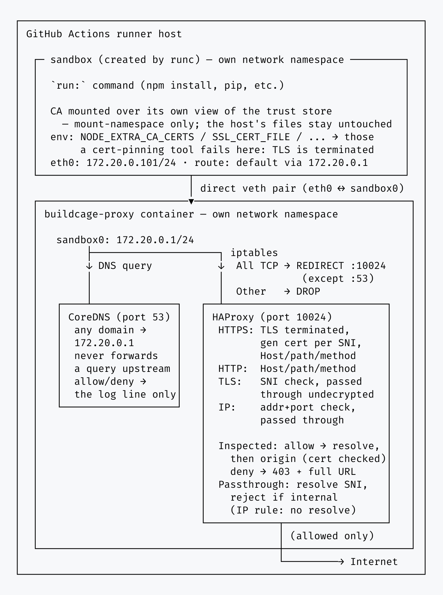

# Security Details

isolated-run applies network isolation (an iptables redirect, a DNS redirect, and an allowlist
proxy) to an arbitrary `run:` command, on the runner host itself rather than inside a build
container. Its threat model differs from a Docker-build tool in one important way: the process being
isolated is a full shell command chosen by the workflow author, running with the same privileges as
the Actions runner. Restricting its network alone is not enough, so the command also has to be
structurally unable to leave its sandbox by other means, whether by escalating privileges, reaching
the Docker socket, or reading another process's memory.

The design goal is to bolt egress control onto an existing workflow step without changing how the
rest of the job works. A step that configures AWS credentials, an npm cache directory, or anything
else keeps running exactly as it did; this action wraps only the command whose network access you
want restricted, rather than asking the surrounding job to move into a differently-configured
environment. That is why UID/GID and `$HOME` are preserved rather than switched to a dedicated
sandbox account (see UID/GID preserved below): tools and caches that assume the runner's own
identity keep working unmodified.

For how to configure the action, see the [README](../README.md). For implementation internals, see
the [Development Guide](./development.md).

## Contents

- [Isolation Mechanisms](#isolation-mechanisms)
- [Inspect Proxy Engine](#inspect-proxy-engine)
- [Universal Proxy Engine](#universal-proxy-engine)
- [Hardening](#hardening)
- [Known Limitations](#known-limitations)
- [Image Provenance Verification](#image-provenance-verification)

## Isolation Mechanisms


This is the sandbox both engines run the command in. What differs between them is only how the proxy
on the other end of the veth pair inspects what arrives.

The isolated command runs as an [OCI](https://github.com/opencontainers/runtime-spec) container
under [runc](https://github.com/opencontainers/runc) rather than being wrapped directly by
`unshare`/`setpriv` on the runner host. `run-isolated.sh` only sets up what runc cannot: wiring a
veth pair directly into the proxy container's own netns, and bind-mounting the host's own `/` for
runc's rootfs (`pivot_root` can't target `/` itself). Everything else below is declared in an OCI
`config.json` and enforced by runc natively.

- **Network namespace**: the isolated command runs in its own network namespace, connected to the
  proxy container's netns by a dedicated veth pair. There is no bridge, since it is always a 1:1
  connection, one sandbox to one proxy. iptables `REDIRECT`/`DROP`, the DNS redirect, and the
  allowlist proxy are what enforce the rules. IPv6 is closed off the same way: `ip6tables` drops all
  forwarded IPv6 traffic from the isolated network, and the internal DNS server returns the IPv6
  unspecified address (`::`) for all queries, so even an allowed domain is never reached over IPv6.
  runc joins this namespace itself, driven by the OCI spec's `linux.namespaces` path, with no
  wrapper needed.
- **Seccomp filter**: derived from Docker's own default seccomp profile (allowlist-based;
  `moby/profiles`), resolved against an empty capability set to match the capability drop below, so
  any syscall Docker's default profile only conditionally allows for a _held_ capability is excluded
  outright. This directly closes the gap historical `io_uring` and unprivileged
  user-namespace-creation CVEs relied on: `unshare(2)`/`clone(2)` with `CLONE_NEWUSER` and the
  `io_uring_*` syscall family are not in the resulting allowlist at all. Generated at action
  startup rather than baked into the image at build time, since a handful of the profile's rules are
  gated on the actual kernel version; see `docker/gen-seccomp-profile/main.go`.
- **Capability bounding set**: fully cleared (all five capability sets emptied in `config.json`)
  before the command executes. This is what actually makes privilege escalation impossible: even if
  the command invokes `sudo` or a setuid binary, there is no `CAP_NET_ADMIN`/`CAP_SYS_ADMIN`/etc.
  left for it to acquire, regardless of the resulting effective UID.
- **`no_new_privileges`**: set as defense-in-depth alongside the capability drop, so setuid/setgid
  binaries and file capabilities can't grant anything even in edge cases the capability drop
  doesn't cover on its own.
- **Supplementary groups cleared, primary group checked too**: any supplementary group membership is
  dropped (the OCI spec's `process.user` carries no `additionalGids`). That alone doesn't cover the
  primary group, though, and a runner's own user could have `docker` (or another container/VM
  runtime group) configured as its primary group rather than a supplementary one -- equivalent to
  root, since the daemon will happily mount `/` into a new privileged container for anyone who can
  reach its socket, regardless of capabilities. So the primary GID is checked against a list of
  group names known to grant this kind of access (`docker`, `containerd`, `podman`, `lxd`, `libvirt`,
  `kvm`, `sudo`, `wheel`, and a few more) and against the owning GID of any container/VM runtime
  socket actually present on the host; if it matches, the sandboxed process runs under
  `nogroup`/`nobody`/GID 65534 instead. If none of those turn out to be safe either, the sandbox
  refuses to start rather than run under a privileged primary GID. As a second, independent layer,
  the sockets themselves (`/var/run/docker.sock`, containerd's, podman's, buildkit's, crio's, and
  their rootless `$XDG_RUNTIME_DIR` equivalents) are masked with `/dev/null` inside the sandbox's own
  mount namespace, so even an unenumerated privileged group wouldn't find a live socket to connect to
  at that path.
- **D-Bus system bus and per-user runtime directory masked**: a read-only mount doesn't stop
  `connect(2)` on a still-live Unix domain socket, since the kernel's permission check for a socket
  connection only looks at write permission bits, which `mount -o ro` doesn't touch. Two more paths
  matter here beyond the container/VM runtime sockets above: `/run/dbus/system_bus_socket`, and the
  whole `/run/user/<uid>` directory, which is where a `systemd --user` instance (if one happens to
  be running for the runner's UID) keeps its own session bus. Reaching that bus lets a compromised
  command start a unit that runs entirely outside every namespace this action creates, bypassing the
  network, filesystem, capability, and seccomp restrictions in this list. Both are masked the same
  way as the runtime sockets above (`linux.maskedPaths`); the per-user directory is masked whole
  rather than by individual socket, so a future tool dropping a new socket there is covered without a
  code change, and a path that doesn't exist on a given runner (there might be no active login
  session) is silently skipped by runc rather than an error.
- **PID namespace**: the isolated command runs in its own PID namespace. This isn't just about
  hiding other processes from `ps`. The Linux kernel structurally forbids a process from tracing
  (`ptrace`) or reading `/proc/<pid>/mem` for any process outside its own PID namespace's lineage,
  independent of capabilities, which closes off memory-dump-based attacks against the Actions runner
  process itself.
- **UID/GID preserved**: unlike the mechanisms above, the isolated command keeps the same UID/GID
  as the runner user rather than switching to a dedicated unprivileged account. This is a deliberate
  choice: `actions/setup-node`-installed toolchains, `$GITHUB_WORKSPACE` file ownership, and
  `$HOME`-based caches (`~/.npm`, `~/.cache`, etc.) all assume the runner's own UID, and switching
  UID would break them. Isolation here comes entirely from the capability/group/namespace
  mechanisms above, not from UID separation. No user namespace is created for this either, since
  that would let the isolated command re-acquire a (namespace-local) root identity via the very
  unprivileged-`CLONE_NEWUSER` primitive the seccomp filter above is specifically closing off.
- **Sensitive `/proc` paths masked**: `/proc/kcore`, `/proc/kallsyms`, `/proc/kmsg`,
  `/proc/sysrq-trigger`, `/proc/timer_list`, and `/proc/keys` are bind-mounted over with `/dev/null`
  (the OCI spec's `linux.maskedPaths`, extending runc's own sensible defaults), closing off
  kernel-memory-adjacent information disclosure paths that aren't already covered by the capability
  drop.
- **Filesystem read-only outside the workspace/home/tmp**: `$GITHUB_WORKSPACE`, `$HOME`, `/tmp`, and
  `$RUNNER_TEMP` are bind-mounted as writable exceptions on top of a read-only root (`root.readonly`
  in `config.json`, applied by runc itself). This closes off tampering with anything outside those
  paths, such as rewriting a binary earlier on `$PATH` to plant a payload for a later, non-sandboxed
  step in the same job. The rest of the host filesystem, including nested mounts, stays fully
  _visible_ (read-only) so existing tools keep working; only writes are restricted. The writable
  exceptions are recursive bind-mounts (preserving any legitimately nested mounts under them); the
  sandbox's own `mount --rbind /` rootfs is staged under `/var/tmp/buildcage-<uid>`, which is never one of
  those writable exceptions, so that recursion doesn't re-expose it as a second, writable copy of
  the whole host `/`. A `writable:` input naming that directory (or an ancestor of it) is rejected
  outright, see [Known Limitations](#known-limitations) below. The `writable` input adds further
  paths to the writable set for tools that need to write elsewhere, such as a cache directory;
  setting it to `/` disables this restriction entirely. This is all `filesystem: persistent`
  (the default and the stable mode) — `filesystem: ephemeral` (**experimental**) replaces it with an
  overlay that discards every write not explicitly named in `allow_write:`, closing off using a
  writable exception itself (not just the read-only area around it) to plant a payload for a later
  step. See [Filesystem access](../README.md#filesystem-access) in the README.
- **Die-with-parent**: the isolated command's life is tied to `run-isolated.sh`'s own via a two-hop
  `setpriv --pdeathsig=KILL` chain (`run-isolated.sh` to `runc run` to the isolated command, since
  `runc run`'s own process sits between the two and a single-hop guard wouldn't be enough). If
  `run-isolated.sh` is killed outright, say an out-of-memory kill lands on it specifically, the
  whole sandboxed process tree is killed with it rather than surviving as an orphan.

## Inspect Proxy Engine

### How it intercepts traffic



`inspect` uses the same sandbox and the same network boundary as `universal` (see
[Isolation Mechanisms](#isolation-mechanisms) above), but terminates TLS instead of only reading the
SNI, so a rule can check the method and the full URL rather than only the destination.

Two components, plus a CA-trust mount:

- **HAProxy** does the inspecting. One listener takes both TLS and plaintext, told apart by the
  first bytes of the connection (`req.ssl_hello_type`), so an audit run records everything without
  being configured for it first. It resolves the requested name itself and connects there
  (`do-resolve` then `set-dst`), only once a request has already passed the rules, so where a
  connection ends up is never the command's choice, and a name a request would be refused for never
  triggers a real DNS query. It also resolves `..` in the path before the rules see it
  (`normalize-uri`), so a rule cannot be walked out of.
- **CoreDNS** never resolves a name for real, allowed or not (see
  [What it actually stops](#what-it-actually-stops) below). It only decides what gets logged as
  allowed or denied, on a regex rather than a domain suffix, which is what lets a rule like
  `abc*.amazonaws.com` be logged accurately instead of collapsing to everything under
  `amazonaws.com`.
- **The CA trust mount** is where this engine differs most from `buildcage/docker`'s. There, a
  wrapper around `runc` writes the CA into the BuildKit worker's own disposable rootfs layer and
  deletes it again before the layer is committed, which is safe because that rootfs is thrown away
  regardless. This action's sandbox rootfs is a `mount --rbind /` of the **real host root**, so
  writing the CA the same way would mean writing it onto the runner's own filesystem. Instead the
  CA, and where relevant an augmented copy of the system CA store, is written into this run's own
  scratch directory and mounted _over_ the sandbox's view of the relevant paths in its OCI
  `config.json`: a mount-namespace-scoped overlay, not a host write. Nothing needs to be undone
  afterwards, since `run-isolated.sh`'s teardown removes it with the rest of the sandbox's mount
  namespace, and the real host files those paths would otherwise resolve to are never touched. See
  [CA trust and compatibility](../README.md#ca-trust-and-compatibility) for which variables are set
  and what that does not cover.

### How a request is handled

```
                        ┌─────────────────────────────────────────┐
   run: ──redirect──▶   │ detect (mode tcp)                       │
                        │   first bytes: handshake or plain?      │
                        └───┬──────────────┬──────────────┬───────┘
                            │              │              │
              ip/tls rule   │      TLS     │    plaintext │
                            ▼              ▼              ▼
                     ┌────────────┐  ┌──────────┐  ┌──────────┐
                     │ passthrough│  │ https_in │  │ http_in  │
                     │  mode tcp  │  │ TLS ter- │  │          │
                     │  undecryp- │  │ minated, │  │          │
                     │  ted       │  │ cert per │  │          │
                     └─────┬──────┘  │ SNI      │  └────┬─────┘
                           │         └────┬─────┘       │
                           │              │             │
                           │      normalize the path    │
                           │      resolve the name here │
                           │      match host/path/method│
                           │              │             │
                           ▼              ▼             ▼
                        origin      origin (TLS,   origin
                                    cert checked)
```

A certificate is generated from the SNI alone, so a refused destination is never contacted: the only
path that reaches an origin is the backend, after a request has already passed the rules. The
origin's own certificate is checked on that same connection.

What each kind of rule decides, and what stays undecrypted:

| Rule                  | What it permits                            | Decided by           | Decrypted |
| --------------------- | ------------------------------------------ | -------------------- | --------- |
| `allowed_https_rules` | any method and path on the host, over TLS  | Host header          | yes       |
| `allowed_http_rules`  | any method and path on the host, plaintext | Host header          | n/a       |
| `allowed_url_rules`   | the named methods on matching URLs         | Host header and path | yes       |
| `allow_tls_rules`     | TLS to the named host and port             | SNI and port         | **no**    |
| `allowed_ip_rules`    | TCP to the address and port, any protocol  | address and port     | **no**    |

### What it actually stops

- **The destination is resolved by the proxy, never chosen by the command, and only after a request
  has already passed the rules.** A forged `Host`, a doctored `/etc/hosts`, or a `Host` naming one
  host while the connection aims at another all reach the address the proxy itself resolved, not
  the one the command chose. Destination spoofing is removed rather than merely detected.
- **A resolved name may not land on an internal address.** An allowlisted name that resolves to
  loopback, link-local (AWS/GCP/Azure IMDS), CGNAT (Alibaba IMDS), the IETF protocol block (Oracle
  IMDS), or the proxy's own address is refused with 403, so a name under an attacker's control
  (or DNS for an allowlisted domain that has been compromised) cannot turn the proxy into a route to
  cloud metadata. RFC1918 is deliberately exempt: a name pointing at an internal mirror is a real,
  intended setup. An address named directly in a rule is exempt too, having been asked for rather
  than arrived at.

  This guard is about a _name_ landing somewhere it never should — it has nothing to do with, and
  never restricts, a rule whose host is itself a literal address (an `https`/`http` rule that names
  one directly, or a `Host` header the request sent as a bare IP): reaching that connection already
  required a rule to match the address as sent, so nothing was arrived at that wasn't first asked
  for. Direct access to a cloud metadata endpoint this way — the normal way any AWS/GCP/Azure CLI or
  SDK reaches it — is not something this guard is meant to stop; `allowed_ip_rules` is the intended,
  always-uninspected path for it (see below).

- **The resolver never forwards a query, allowed or not.** Every name is answered locally with the
  proxy's own address, so a lookup alone, even one the command never connects on, cannot be used as an
  exfiltration channel (`SECRET-DATA.attacker.example` would otherwise reach an attacker's own
  nameserver the moment it was forwarded). A name outside the allowlist is answered the same way
  rather than with NXDOMAIN, so the request that follows is recorded with its full URL, query string
  included, before it is refused.
- **A wide host rule paired with a narrow path or method does not narrow the DNS side.** DNS has no
  notion of a path, so a name under an allowed `*.example.com` is logged as allowed the moment it is
  looked up, before any path is known. The request that follows is still refused and still never
  reaches an origin; only the log line, not the outcome, reflects the host-only nature of that
  decision. Real resolution happens exactly once, in HAProxy, strictly after a request has passed
  the full rule check, which is an invariant rather than an optimisation: reversed, `do-resolve`
  would itself become the live exfiltration channel CoreDNS is built to avoid being. See
  [Rule syntax](../README.md#rule-syntax) for how to write a host pattern that doesn't widen this
  more than intended.
- **The path is normalized, and traversal encodings are rejected outright.** `..`, `%2e%2e`,
  `..%2f`, a raw backslash, and `..%5c` are all refused rather than resolved, so a rule cannot be
  walked out of.

### Attempts to get around it

| What the isolated command does                         | What happens                                                                                                             |
| ------------------------------------------------------ | ------------------------------------------------------------------------------------------------------------------------ |
| Asks for any name, on or off the allowlist             | Answered locally with the proxy's own address; the query is never forwarded, allowed or not                              |
| Requests a host no rule covers                         | **403**, recorded with its full URL, origin never contacted                                                              |
| Requests a path or method no rule covers               | **403**, recorded with its full URL                                                                                      |
| Walks out of an allowed path with `..`                 | **403**: the path is normalised before the rules see it                                                                  |
| Encodes the traversal as `%2e%2e` or `..%2f`           | **403**: decoding happens first, and what no normaliser can strip is refused outright                                    |
| Uses a backslash, raw or `%5c`, to climb               | **403**: the URL standard treats `\` as `/` for http(s), so a raw backslash is refused outright and `..%5c` like `..%2f` |
| Sends an allowed name while aiming elsewhere           | Reaches the address the proxy resolved, not the one the command chose                                                    |
| Puts an address in the Host header                     | Taken as the destination only if a rule names it; the rules decide either way                                            |
| Points `/etc/hosts` at an address of its choosing      | Same: the command's own address is discarded                                                                             |
| Allowlists a name that resolves to an internal address | **403**: the resolved address is refused if it is loopback, link-local, the proxy itself, or another never-public range  |
| Reaches an allowed host presenting a wrong certificate | **503**: the origin's certificate is checked when the proxy connects                                                     |
| Speaks a protocol that is not TLS on any port          | Classified by its first bytes, so it is parsed as HTTP if it is HTTP                                                     |
| Ignores the proxy variables entirely                   | No effect: interception is at the network level, not opt-in                                                              |

### What it can't do

- **TLS is terminated**, so a tool that pins a certificate, or ships its own trust store instead of
  reading the common CA-trust environment variables, will not work. The JVM (Java, Kotlin, Scala)
  is the common case. Use `universal` for those, and see
  [CA trust and compatibility](../README.md#ca-trust-and-compatibility) for the rest of the
  compatibility picture.
- **`audit` is not a passive observer here.** TLS is terminated in both modes, so a tool that cannot
  accept the CA fails under `audit` exactly as it would under `restrict`. What `audit` drops is the
  rule ACLs, not the interception: `set-dst` and the origin certificate check stay, because neither
  can be dropped honestly.

  The internal-address guard above stays active in `audit` too, unconditionally: a name resolving
  to cloud metadata isn't traffic `audit` needs to observe, since nothing legitimate depends on that
  specific resolved address. A literal-IP request, such as a command calling a metadata endpoint
  directly, is unaffected by this guard in either mode — blocking it would only hide real
  information about what the command needs, without closing anything DNS could have redirected.

- **`allow_tls_rules` and `allowed_ip_rules` stay uninspected by design.** Each is recorded with a
  byte count and nothing more, since neither carries a name the proxy can re-terminate TLS for.
- **Query strings are kept in the log**, since that is also where an exfiltration payload would go.
- **UDP is dropped**, so QUIC and HTTP/3 fall back to TCP or fail. Port 53 to the gateway is the one
  exception, which is the resolver. ICMP is dropped too.
- **No content digests, and no SLSA-style materials.** Nothing here attests to what a request
  returned, only that it was made and to what.

## Universal Proxy Engine

### How it sees traffic

The default engine, and the one to fall back to when something in the command cannot accept the
`inspect` engine's CA. It decrypts nothing: HAProxy classifies each connection by what it can read
at the front of it, then checks that against the allowlist.

It sits at the same network boundary as `inspect` (see
[Isolation Mechanisms](#isolation-mechanisms) above): one veth pair into the proxy container's
netns, all TCP redirected to a single listener, and everything else dropped.

- **HTTPS**: the SNI from the TLS ClientHello, read without terminating the connection, so the
  command validates the origin's own certificate itself. Checked against `allowed_https_rules`.
- **HTTP**: the `Host` header, checked against `allowed_http_rules`. A request carrying none is
  refused with 400, since there is nothing to check it against.
- **A connection to a bare address**: nothing at all. It skipped DNS, so there is no name to read.
  It is matched against `allowed_ip_rules` as `ip:port` and, when nothing matches, refused.

dnsmasq answers every query with the proxy's own address (`address=/#/172.20.0.1`) and has no
upstream at all (`no-resolv`), which is both what puts a name-based connection in front of the proxy
and what keeps a DNS query from becoming an exfiltration channel. Once a request has passed the
rules, HAProxy resolves the name itself and rewrites the destination to the result (`set-dst`), so
the command's own choice of address is discarded here as well.

Nothing in the command has to trust an injected CA or be told about a proxy, which is what lets this
engine cover any language or package manager, a pinned certificate included.

### What it stops

- **Where a connection ends up is not the command's choice.** The proxy resolves the name it read from
  the SNI or the `Host` header and connects to that address, so a request that was allowed for a
  name always reaches the server that name belongs to.
- **A resolved name may not land on an internal address.** The same guard as
  [`inspect`](#inspect-proxy-engine)'s (see [What it actually stops](#what-it-actually-stops)):
  loopback, link-local, CGNAT, the IETF protocol block, and the proxy's own address are all refused
  (`internal-address` in the report). Unlike `inspect`, there's no literal-address exemption to carve
  out here — a connection to a bare address never reaches this guard at all, since it skips DNS and
  `do-resolve` entirely on a separate code path; `allowed_ip_rules` is the always-uninspected path for
  a destination named directly.
- **DNS never leaves the job.** The internal resolver has no upstream and answers every query
  locally, so a name carrying data in its labels reaches nobody. The iptables rules leave no path to
  an outside resolver either.
- **The real SNI cannot be hidden.** Encrypted Client Hello needs ECHConfig keys from a DNS HTTPS
  (type 65) record, which a resolver with no upstream never returns.
- **Nothing but TCP gets out.** Everything else is dropped before it reaches the proxy, so ICMP, raw
  UDP and QUIC have no exit path at all.
- **IPv6 is not a way around any of this.** Equivalent ip6tables rules drop forwarded IPv6, the
  resolver answers with the unspecified address (`::`) for every query, and the proxy reaches
  allowed names over IPv4 only.

### Attempts to bypass it

| What the isolated command does                         | What happens                                                                                                                                         |
| ------------------------------------------------------ | ---------------------------------------------------------------------------------------------------------------------------------------------------- |
| Sets an allowed name in the SNI while aiming elsewhere | Reaches the server the proxy resolved that name to, not the one the command chose                                                                    |
| Allowlists a name that resolves to an internal address | Refused: the resolved address is checked and rejected if it is loopback, link-local, the proxy itself, or another never-public range, in `audit` too |
| Uses ECH to conceal the real SNI                       | The handshake cannot start: the type 65 record it needs is never returned                                                                            |
| Encodes data into DNS queries                          | Answered locally and never forwarded; an outside resolver is unreachable                                                                             |
| Tunnels over ICMP, raw UDP, or QUIC                    | Dropped before the proxy; only TCP is redirected to it                                                                                               |
| Falls back to IPv6                                     | Forwarded IPv6 is dropped, lookups answer `::`, and the proxy connects over IPv4                                                                     |
| Uses DNS over TLS or DNS over HTTPS                    | Redirected to the proxy like any other TCP and checked on its SNI, so an outside resolver is reachable only if its own host and port are allowlisted |
| Connects to a raw address                              | Checked against `allowed_ip_rules`, and refused when nothing matches                                                                                 |
| Ignores the proxy variables entirely                   | No effect; interception is at the network level, not opt-in                                                                                          |

### What it can't see

**Nothing inside the tunnel is visible.** A rule reaches as far as a host and a port. The method and
the path travel inside TLS, so neither can be enforced, and neither appears in the report.
[`inspect`](#inspect-proxy-engine) is what reads them.

**An allowlisted address is an uninspected pipe.** Unlike the HTTPS and HTTP paths, a matched
direct-IP connection is passed through as a raw TCP stream and its protocol is never checked. Once
an `ip:port` pair is allowlisted, any TCP-based protocol can use that path. Prefer domain rules
(`allowed_https_rules` / `allowed_http_rules`), and keep `allowed_ip_rules` for destinations that
genuinely have no stable hostname.

**Domain fronting.** This engine reads the SNI but cannot decrypt what follows, and the `Host`
header that would reveal the real target is inside the tunnel:

```
1. ClientHello SNI: allowed.example.com     ← all Buildcage sees → allowed
2. HTTP Host header: malicious.example.com  ← encrypted, not inspectable
3. The CDN routes on the Host header        → reaches the attacker's server
```

For this to work, the allowed domain and the target domain have to sit on the same CDN or hosting
infrastructure. Closing the gap needs the proxy to terminate TLS and read that header, which is what
[`inspect`](#inspect-proxy-engine) does: `allowed_url_rules` matches on the real `Host`, so a
fronted request lands outside any host rule it was written for.

Staying on `universal`, what narrows it:

- **Allow as few domains as possible.** Every extra host is another place a fronted request could
  hide.
- **Avoid broad CDN wildcards** such as `*.cdn.example.com`, and prefer a service's own domain:
  `registry.npmjs.org` over a shared CDN host.
- **Check your CDN's position.** Major providers including CloudFront and Cloudflare have
  introduced measures restricting domain fronting; consult your provider's documentation for what
  applies today.
- **Re-run [audit mode](../README.md#operation-modes) periodically** to notice a connection pattern
  that has changed.

## Hardening

An allowlist decides which destinations a step can reach. It works on domain names, so it cannot
tell a legitimate use of an allowed destination from an abusive one. Anything leaving through a
service you had to allow anyway still leaves. That is a structural limit, not something a better
rule set fixes.

What it does stop is narrower. Traffic to a destination that is not on the list does not go out, and
infrastructure an attacker set up is normally not on it, because the command has no reason to reach
it. That is also the hardest kind of leak to find afterwards, which is why closing it is worth doing
even though the rest stays open.

An attacker who sends the same data through a service the command already uses stays inside the
limit above. The rest of this section is about making that set of services smaller. Buildcage runs
against the command you already have, and an allowlist generated from an audit run already blocks
every destination the audit did not record. Weigh what follows against what the step has access to.

### Keep each rule as narrow as it can be

An audit run only ever emits the exact `host:port` pairs it observed. Wildcards and `:*` ports come
from broadening a rule by hand, and each one covers destinations the command never asked for. Where
a broad rule exists, it is worth checking whether the command can be changed instead.

Pay particular attention to general-purpose destinations: a gist host, object storage, or an API
that can create repositories. They accept uploads as readily as they serve downloads, which is what
makes them useful for sending data out.

### Reduce what has to be reachable

Each step carries its own allowlist, so work that needs a wide one can be separated from work that
does not. Fetching dependencies is usually what puts a package registry on the list:

```yaml
- name: Install
  uses: buildcage/isolated-run@<sha>
  with:
    allowed_https_rules: registry.npmjs.org:443
    run: npm ci --ignore-scripts

- name: Build and test
  uses: buildcage/isolated-run@<sha>
  with:
    allowed_https_rules: "" # nothing
    run: |
      npm run build
      npm test
```

This only helps when fetching does not itself execute dependency code. `--ignore-scripts` makes that
explicit rather than leaning on npm's default, and it is what keeps the step with the registry and
the step running third-party code separate. Where fetching does run third-party code, such as a
`pip install` that builds an sdist or a Cargo build script, the split moves nothing, because the
code still runs where the network is.

A mirror configured as a read-only pull-through cache serves upstream packages on demand and
accepts no publishes, so nothing can be uploaded to the destination on your allowlist. Running one
is a bigger commitment than anything else in this section.

### Keep the rest of your supply chain practice

Pinning versions, lockfiles, review, least-privilege tokens, and a dependency cooldown each cover
something an allowlist does not. Buildcage is one layer among them, not a replacement for any.

## Known Limitations

- **`writable:` cannot name the sandbox's own scratch directory**: a `run:` step's `writable:` input
  listing `/var/tmp/buildcage-<uid>` (or an ancestor of it, `/var/tmp` or `/` for instance) is rejected
  outright. That directory holds the run's own `mount --rbind /` rootfs, and the writable exceptions
  are recursive bind-mounts, so allowing it would recursively re-expose the whole host `/` inside
  the sandbox as a second, writable copy. This is a misconfiguration guard against an
  operator-supplied `writable:` value, not a defense against the isolated command itself (see
  [Filesystem access](../README.md#filesystem-access) in the README).
- **Scratch directory on a multi-user host**: `/var/tmp` is world-writable (sticky bit set), so on a
  host shared with other, unprivileged local users, one of them could pre-create
  `/var/tmp/buildcage-<uid>` themselves before the action ever runs, as a symlink, or as a
  world-writable directory, and redirect the OCI bundle (secrets included), the root-run
  `mount --rbind /`, and cleanup's `sudo umount`/`rm -rf` wherever they chose. This is technically outside
  this action's threat model (isolating a malicious `run:` command, not defending against a separate
  actor already on the host, see [Co-located workflow step tampering](#known-limitations) below for
  the same principle applied to another step in the same job), but the bar here is only an ordinary
  local account, not root or the `docker` group, so the action verifies the base directory's owner,
  type, and mode at startup and refuses to proceed rather than silently reusing an unexpected one. If
  a host is genuinely shared with other local users, prefer a dedicated, single-tenant runner (one
  host, one user) over relying on this check alone.
- **Docker cannot be used inside the isolated command**: the primary GID substitution and the masked
  runtime sockets (see [Supplementary groups cleared, primary group checked
  too](#isolation-mechanisms) above) together mean the isolated command can neither reach a runtime
  socket through group membership nor find one still present at its usual path. A `run:` step that
  itself needs to invoke `docker` (build an image, run a container, etc.) cannot be wrapped by this
  action.
- **`$XDG_RUNTIME_DIR` is an empty directory inside the sandbox**: `/run/user/<uid>` (and any other
  path `$XDG_RUNTIME_DIR` points at) is masked whole, see [D-Bus system bus and per-user runtime
  directory masked](#isolation-mechanisms) above, so a tool that expects to read or write something
  there, a session keyring, a PipeWire/Wayland socket, its own scratch state, finds nothing and, if
  it writes, fails outright rather than silently landing on the host's real directory. There's no
  opt-out input for this; it's considered part of the same hardening as the container-runtime-socket
  masking above, not a separate, disableable feature.
- **Credential retrieval is intentionally not blocked**: this action restricts _where_ the isolated
  command can send network traffic, but not what it reads. A compromised dependency can still read
  `~/.aws/credentials`, `~/.docker/config.json`, or similar local credential files anywhere on the
  filesystem; it just cannot exfiltrate them anywhere outside the allowlist. That's unaffected by
  `filesystem` mode.
- **`filesystem: persistent` (the default) lets the command plant a payload for a later step, not
  just read one**: since the filesystem is read-only outside
  `$GITHUB_WORKSPACE`/`$HOME`/`/tmp`/`$RUNNER_TEMP`, that's also _where_ it can persist one.
  `GITHUB_OUTPUT`, `GITHUB_ENV`, and `GITHUB_PATH` live under `$RUNNER_TEMP`, a writable exception,
  so the isolated command can set an output, an env var, or `$PATH` for later steps exactly as an
  un-sandboxed one could — and the same goes for `~/.bashrc`, `~/.npmrc`, `~/.docker/config.json`,
  and anything else under `$HOME`, `/tmp`, or `$GITHUB_WORKSPACE`. `filesystem: ephemeral`
  (**experimental** — see [Filesystem access](../README.md#filesystem-access) in the README) closes
  this off for everything except what's explicitly named in `allow_write:` — which in practice has to include
  `$GITHUB_WORKSPACE` for the job to do anything useful, so that specific path (and whatever else you
  list) remains exactly as exposed to this as `persistent` mode always is. `$RUNNER_TEMP` and `/tmp`
  are also the same real directory across every invocation of this action in a job, not scoped per
  sandbox, in `persistent` mode: two concurrent invocations are isolated at the container/network
  level (see [Notes](../README.md#notes)), not the filesystem, so one can reach another's in-flight
  scratch files there. `filesystem: ephemeral` resolves this too, since each invocation gets its own
  overlay.
- **`filesystem: ephemeral` (experimental) requires overlayfs support on the runner's own
  filesystem**: checked with a preflight probe before the sandbox starts, so an unsupported runner fails the step with a clear
  error rather than a cryptic one partway through. This is known to fail when the runner process
  itself runs inside a container whose own root filesystem is overlayfs (common for container-based
  self-hosted runners), since the kernel doesn't allow an overlay mount's `upperdir`/`workdir` to
  themselves sit on overlayfs — `filesystem: persistent` remains available on any runner this action
  otherwise supports.
- **Linux only**: requires a Linux runner with passwordless `sudo` for the isolation setup itself
  (network namespace, veth, iptables) and a working Docker installation (client and daemon) for the
  sandbox proxy container. Both are the default on GitHub-hosted `ubuntu-*` runners, but not on
  lightweight images such as `ubuntu-slim`, which ships a Docker client with no daemon. Not
  supported on Windows or macOS runners.
- **Rootful Docker assumed**: the isolation joins the proxy container's network namespace via its
  host-visible PID (`docker inspect .State.Pid`, entered as `/proc/<pid>/ns/net`). This assumes
  containers share the host PID namespace, as they do on the default GitHub-hosted runner setup.
  Under rootless Docker or `userns-remap`, that PID may not be directly reachable, so this action
  is not currently supported on those setups.
- **Per-step overhead**: each step starts and stops its own proxy container, rather than sharing
  one across steps in the same job. This keeps allowlists independently configurable per step and
  keeps the traffic report's step-to-container mapping unambiguous, at the cost of container
  startup overhead on jobs with many isolated steps.
- **No CPU/memory/process-count limits (out of scope by design)**: the OCI `config.json` runc builds
  for the isolated command never sets `linux.resources`, so the cgroup it runs under carries no
  memory, pids, or CPU ceiling. Capability bounding and the seccomp profile don't close this either,
  since a legitimate build has to call `fork(2)` and `mmap(2)` freely. A fork bomb or a runaway
  allocation inside the isolated command isn't refused, it consumes host memory or the host process
  table until something else gives out. This isn't a containment gap: the threat model here is
  confining where the command's network traffic goes, not bounding what it consumes, and wrapping a
  step with this action doesn't change that step's exposure, since an un-sandboxed `run:` step has
  exactly the same absence of cgroup limits on the same host. On GitHub-hosted runners that stays
  contained to the job's own disposable VM; on a shared self-hosted runner it can starve other jobs
  running alongside it. Bounding that is a runner-service concern, not a per-step one, for instance a
  systemd slice's `MemoryMax=`/`TasksMax=` around the runner service itself, not something this
  action's OCI spec attempts.
- **Co-located workflow step tampering (out of scope by design)**: the threat model here is
  preventing network exfiltration by malicious code inside the wrapped command, the contents of the
  command itself. **A malicious workflow environment, a compromised or untrustworthy third-party
  action running as another step in the same job, is out of scope by design.** Such a step could use
  `docker exec`/`docker cp` (or, with the host root a passwordless-sudo runner grants by default,
  direct filesystem access) to tamper with the proxy container's state, most notably its traffic
  log, since the Sigstore verification below only proves the image was genuine at startup, not
  afterward. This is mitigated a little, in that a log with no trace of a real proxy run is treated
  as suspicious rather than an automatic pass, but the effective defense is procedural, not
  technical: don't place an untrusted workflow step immediately around this action.

## Image Provenance Verification

isolated-run decides what a step can reach, so it is fair to ask what says the isolated-run image is
the one this repository published.

Each release's image is bound to the CI workflow that built it by [Sigstore](https://sigstore.dev)
keyless signing, and the action verifies that binding at startup. The signature covers the exact
source commit SHA, so a tampered or substituted image fails verification before it is used. Pin to a
commit SHA (or a version tag) and update on your own schedule: verification is what confirms you are
running exactly what was built from that commit.

### How it works

**Signing (at release time):** when a release tag is pushed, the `docker-publish.yml` workflow
builds and signs the Docker image using a short-lived OIDC identity issued by GitHub Actions. The
signature is stored as a **Sigstore Bundle v0.3** attached to the image via the OCI 1.1 Referrers
API in GHCR. The bundle holds the signature, a Fulcio leaf certificate embedding the workflow
identity, and a Rekor transparency log entry.

**Verification (at action startup, `main` phase):** the action verifies the image entirely
in-process using `@sigstore/verify`, `@sigstore/tuf` and `@sigstore/bundle`. No external binary
(cosign, for instance) is downloaded or required. The flow:

```
1. Fetch manifest-list digest
       docker buildx imagetools inspect <image>:<tag>
       (uses docker login credentials, so private packages work)
            ↓
2. Fetch registry pull token
       GET https://ghcr.io/token?scope=repository:<repo>:pull
         → logged in (docker/login-action): Basic auth with Docker config credentials
         → not logged in: anonymous request (public packages only)
            ↓
3. Pull Sigstore Bundle from OCI Referrers API
       GET /v2/<repo>/referrers/<digest>  → locate bundle manifest
       GET /v2/<repo>/blobs/<bundleDigest> → fetch bundle JSON
            ↓
4. Cryptographic + identity verification (@sigstore/verify, TUF-backed trust root)
       verifyBundle(bundleJson, {
         certificateIssuer,       ← OIDC issuer enforced cryptographically
         certificateIdentityURI,  ← SAN regexp: workflow URL + ref/version
         certificateOIDs,         ← OID 1.13: Source Repository Digest (SHA pin)
       }, expectedDigest)
            ↓
5. Signed digest assertion (fail-closed)
       Parse DSSE payload → subject[].digest.sha256 (in-toto v1, --new-bundle-format)
       Must equal the digest fetched in step 1 (strict string equality)
       Mismatch → VERIFY_FAILED (closes the Referrers API attribution gap)
```

Every identity check (OIDC issuer, signing workflow, ref/SHA claim, manifest digest) is enforced
inside the single `verifyBundle()` call, equivalent to cosign's `--certificate-oidc-issuer`,
`--certificate-identity-regexp` and `--certificate-github-workflow-sha`, plus the implicit
digest-match cosign performs against its target image argument.

### Identity matching by reference type

| How the action is pinned       | Identity check                                              | Mechanism                                                              |
| ------------------------------ | ----------------------------------------------------------- | ---------------------------------------------------------------------- |
| `@<40-char SHA>`               | Source Repository Digest **strictly equals** the pinned SHA | `certificateOIDs`: Fulcio OID `1.3.6.1.4.1.57264.1.13`, raw byte match |
| `@v1.0.0` (exact version)      | SAN matches `...@refs/tags/v1\.0\.0(\.\|$)`                 | `certificateIdentityURI` regexp                                        |
| `@v1` (major-floating)         | SAN matches `...@refs/tags/v1(\.\|$)`                       | `certificateIdentityURI` regexp                                        |
| A branch name, or a local path | **Hard fail**: pin to a version tag or commit SHA           |                                                                        |

For the strongest guarantee, pin to a **commit SHA**:

```yaml
uses: buildcage/isolated-run@<40-char-sha> # vX.Y.Z
```

The SHA check is the core of tamper detection: it confirms the Docker image was built from exactly
the same source tree as the pinned action commit. An image built from a different commit fails
verification even if it is signed.

### What this prevents

An attacker who can push a malicious image to `ghcr.io/buildcage/isolated-run` without compromising
the repository cannot produce a valid Sigstore bundle. The bundle's Fulcio certificate requires a
GitHub Actions OIDC token that is only issued during an actual workflow run on the real repository.

This is **one layer of a defense-in-depth strategy**, not a complete guarantee. It reduces the
attack surface to the registry layer and forces an attacker to compromise the GitHub account or the
repository itself, which raises the cost and leaves an audit trail in the Rekor transparency log.

Binding the image digest to the exact source commit SHA also serves as an alternative to
reproducible builds: it establishes that the published artifact was produced from a specific source
commit without requiring an independent rebuild.

### Verification Limitations

Verification establishes where the image came from. Here is what it leaves uncovered.

- **A signature says who built the image, not what the code does.** It attests that this
  repository's release workflow built it from the pinned commit, and a release published by someone
  who has taken over that identity verifies just as cleanly as a legitimate one. Two things limit
  the damage: with a commit-SHA pin, a newly published release cannot reach your workflow until you
  change the pin yourself, and every signature is recorded in the Rekor transparency log, so an
  unintended release is discoverable after the fact.

- **Sigstore has to be reachable.** Verification depends on the Rekor transparency log and the
  Fulcio CA, and fetches the TUF trust root at verification time. An outage there fails the action
  rather than skipping the check.

- **The registry decides which signed image gets verified.** Resolving the tag yields a manifest
  digest, and everything after that is bound to it: the bundle is fetched by digest, the verified
  signature must cover that same digest, and the `docker pull` is digest-pinned. Content substituted
  at any point after the tag lookup therefore makes verification **fail** rather than falsely pass,
  leaving no time-of-check/time-of-use gap. What remains is the tag lookup itself: an attacker with
  write access to the registry could repoint the tag, but only at an image genuinely signed for the
  same pinned commit, in practice another image from that same release.

- **A build-time test hook exists, but not in what you run.**
  `BUILDCAGE_BUILD_TEST_HOOKS=1 vp run build` produces a `dist/` where a `BUILDCAGE_LOCAL_IMAGE_REF`
  override can point the action at an unpublished image, used only by this repo's own CI and local
  development. Tree-shaking drops that module out of every normal build, and a CI check inspects the
  published `dist/` to confirm it never reads the flag, so no `env:` a consumer sets can reach it.
  See [development.md](./development.md#local-development).
