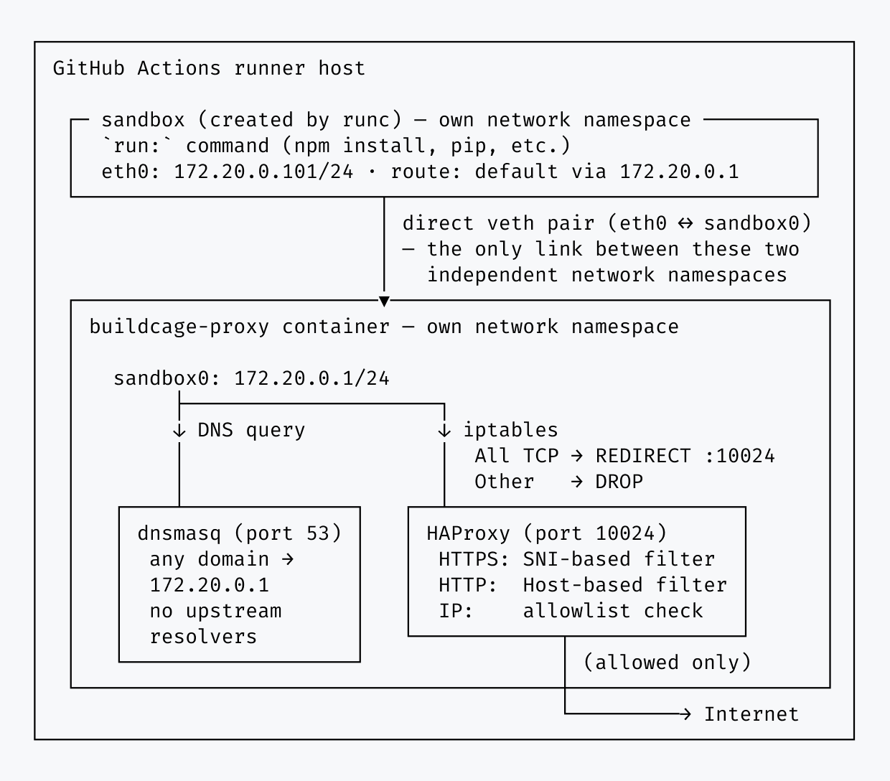

# Security Details

isolated-run applies network-level isolation (iptables redirect, DNS redirect, SNI/Host-based
allowlist proxy) to an arbitrary `run:` command, on the runner host itself rather than inside a
Docker build container. Its threat model differs from a Docker-build-isolation tool in one
important way: the process being isolated is a full shell command chosen by the workflow author,
running with the same privileges as the Actions runner itself (rather than inside an
isolated OCI container by default), so isolating its _network_ access is not sufficient on its
own — the isolated command must also be structurally unable to reach outside its sandbox by other
means (escalating privileges, reaching the Docker socket, or reading another process's memory).

The core design goal is to let you bolt network egress control onto an existing workflow step
without changing how the rest of that workflow already works. A step that configures AWS
credentials, an npm/yarn cache directory, or any other action keeps running exactly as it did
before this action was introduced — it only wraps the specific command whose network access you
want restricted, rather than requiring the surrounding job to move into a differently-configured
environment. This is why UID/GID and `$HOME` are preserved rather than switched to a dedicated
sandbox account (see UID/GID preserved below): tools and caches that assume the runner's own
identity keep working unmodified.

## Isolation Mechanisms



The isolated command runs as an [OCI](https://github.com/opencontainers/runtime-spec) container
under [runc](https://github.com/opencontainers/runc) rather than being wrapped directly by
`unshare`/`setpriv` on the runner host. `run-isolated.sh` only sets up what runc cannot: wiring a
veth pair directly into the proxy container's own netns, and bind-mounting the host's own `/` for
runc's rootfs (`pivot_root` can't target `/` itself). Everything else below is declared in an OCI
`config.json` and enforced by runc natively.

- **Network namespace**: the isolated command runs in its own network namespace, connected to the
  proxy container's netns by a dedicated veth pair (no bridge — it's always a 1:1 connection, one
  sandbox to one proxy) — iptables `REDIRECT`/`DROP`, DNS redirect, and an SNI/Host allowlist proxy
  enforce the allowlist. IPv6 is closed off the same way: `ip6tables` drops all forwarded IPv6
  traffic from the isolated network, and the internal DNS server returns the IPv6 unspecified
  address (`::`) for all queries, so even an allowed domain is never reached over IPv6. runc joins
  this namespace itself, driven by the OCI spec's `linux.namespaces` path — no wrapper needed.
- **Seccomp filter**: derived from Docker's own default seccomp profile (allowlist-based;
  `moby/profiles`), resolved against an empty capability set to match the capability drop below —
  so any syscall Docker's default profile only conditionally allows for a _held_ capability is
  excluded outright. This directly closes the gap historical `io_uring` and unprivileged
  user-namespace-creation CVEs relied on: `unshare(2)`/`clone(2)` with `CLONE_NEWUSER` and the
  `io_uring_*` syscall family are not in the resulting allowlist at all. Generated at action
  startup (not baked into the image at build time), since a handful of the profile's rules are
  gated on the actual kernel version — see `docker/gen-seccomp-profile/main.go`.
- **Capability bounding set**: fully cleared (all five capability sets emptied in `config.json`)
  before the command executes. This is what actually makes privilege escalation impossible — even
  if the command invokes `sudo` or a setuid binary, there is no `CAP_NET_ADMIN`/`CAP_SYS_ADMIN`/etc.
  left for it to acquire, regardless of the resulting effective UID.
- **`no_new_privileges`**: set as defense-in-depth alongside the capability drop, so setuid/setgid
  binaries and file capabilities can't grant anything even in edge cases the capability drop
  doesn't cover on its own.
- **Supplementary groups cleared**: `docker` and any other supplementary group membership is
  dropped (the OCI spec's `process.user` carries no `additionalGids`). Runner users are typically
  members of the `docker` group, which is equivalent to root — the Docker daemon will happily mount
  `/` into a new privileged container for anyone who can reach its socket, regardless of that user's
  own capabilities. Group membership is what gates that reach, not capabilities, so it has to be
  cleared independently.
- **PID namespace**: the isolated command runs in its own PID namespace. This isn't just about
  hiding other processes from `ps` — the Linux kernel structurally forbids a process from tracing
  (`ptrace`) or reading `/proc/<pid>/mem` for any process outside its own PID namespace's lineage,
  independent of capabilities. This closes off memory-dump-based attacks against the Actions runner
  process itself.
- **UID/GID preserved**: unlike the mechanisms above, the isolated command keeps the same UID/GID
  as the runner user rather than switching to a dedicated unprivileged account. This is a deliberate
  choice: `actions/setup-node`-installed toolchains, `$GITHUB_WORKSPACE` file ownership, and
  `$HOME`-based caches (`~/.npm`, `~/.cache`, etc.) all assume the runner's own UID, and switching
  UID would break them. Isolation here comes entirely from the capability/group/namespace
  mechanisms above, not from UID separation. No user namespace is created for this either — that
  would let the isolated command re-acquire a (namespace-local) root identity via the very
  unprivileged-`CLONE_NEWUSER` primitive the seccomp filter above is specifically closing off.
- **Sensitive `/proc` paths masked**: `/proc/kcore`, `/proc/kallsyms`, `/proc/kmsg`,
  `/proc/sysrq-trigger`, `/proc/timer_list`, and `/proc/keys` are bind-mounted over with `/dev/null`
  (the OCI spec's `linux.maskedPaths`, extending runc's own sensible defaults), closing off
  kernel-memory-adjacent information disclosure paths that aren't already covered by the capability
  drop.
- **Filesystem read-only outside the workspace/home/tmp**: `$GITHUB_WORKSPACE`, `$HOME`, `/tmp`, and
  `$RUNNER_TEMP` are bind-mounted as writable exceptions on top of a read-only root (`root.readonly`
  in `config.json`, applied by runc itself). This closes off tampering with anything outside those
  paths — e.g. rewriting a binary earlier on `$PATH` to plant a payload for a later, non-sandboxed
  step in the same job. The rest of the host filesystem, including nested mounts, stays fully
  _visible_ (read-only) so existing tools keep working; only writes are restricted. The writable
  exceptions are recursive bind-mounts (preserving any legitimately nested mounts under them); the
  sandbox's own `mount --rbind /` rootfs is staged under `/var/tmp/buildcage`, which is never one of
  those writable exceptions, so that recursion doesn't re-expose it as a second, writable copy of
  the whole host `/`. A `writable:` input naming that directory (or an ancestor of it) is rejected
  outright — see [Known Limitations](#known-limitations) below. The `writable` input adds further
  paths to the writable set for tools that need to write elsewhere (e.g. a cache directory); setting
  it to `/` disables this restriction entirely — see
  [Filesystem access](../README.md#filesystem-access) in the README.
- **Die-with-parent**: the isolated command's life is tied to `run-isolated.sh`'s own via a two-hop
  `setpriv --pdeathsig=KILL` chain (`run-isolated.sh` → `runc run` → the isolated command — `runc
run`'s own process sits between the two, so a single-hop guard wouldn't be enough). If
  `run-isolated.sh` is killed outright (e.g. an out-of-memory kill lands on it specifically), the
  whole sandboxed process tree is killed with it rather than surviving as an orphan.

## Known Limitations

- **No AppArmor/SELinux/Landlock policy**: these would add path-level MAC restrictions on top of
  the capability-based model above. Not applied today; the isolation mechanisms above already
  close off the specific escape routes considered (privilege escalation, Docker-socket access,
  cross-namespace ptrace/memory access).
- **`writable:` cannot name the sandbox's own scratch directory**: a `run:` step's `writable:` input
  listing `/var/tmp/buildcage` (or an ancestor of it, e.g. `/var/tmp` or `/`) is rejected outright —
  that directory holds the run's own `mount --rbind /` rootfs, and the writable exceptions are
  recursive bind-mounts, so allowing it would recursively re-expose the whole host `/` inside the
  sandbox as a second, writable copy. This is a misconfiguration guard against an operator-supplied
  `writable:` value, not a defense against the isolated command itself (see
  [Filesystem access](../README.md#filesystem-access) in the README).
- **Docker cannot be used inside the isolated command**: supplementary groups (including `docker`)
  are cleared before the command runs, so even where the Docker socket is visible through the
  read-only host filesystem, the isolated command has no permission to use it. A `run:` step that
  itself needs to invoke `docker` (build an image, run a container, etc.) cannot be wrapped by this
  action.
- **Credential retrieval is intentionally not blocked**: this action restricts _where_ the isolated
  command can send network traffic and, since the filesystem is read-only outside
  `$GITHUB_WORKSPACE`/`$HOME`/`/tmp`, _where_ it can persist a payload — but not what it reads. A
  compromised dependency can still read `~/.aws/credentials`, `~/.docker/config.json`, or similar
  local credential files anywhere on the filesystem; it just cannot exfiltrate them anywhere outside
  the allowlist.
- **Linux only**: requires a Linux runner with passwordless `sudo` for the isolation setup itself
  (network namespace, veth, iptables) and a working Docker installation (client and daemon) for the
  sandbox proxy container — both are the default on GitHub-hosted `ubuntu-*` runners, but not on
  lightweight images such as `ubuntu-slim`, which ships a Docker client with no daemon. Not
  supported on Windows or macOS runners.
- **Rootful Docker assumed**: the isolation joins the proxy container's network namespace via its
  host-visible PID (`docker inspect .State.Pid`, entered as `/proc/<pid>/ns/net`). This assumes
  containers share the host PID namespace, as they do on the default GitHub-hosted runner setup.
  Under rootless Docker or `userns-remap`, that PID may not be directly reachable, so this action
  is not currently supported on those setups.
- **Per-step overhead**: each step starts and stops its own proxy container, rather than sharing
  one across steps in the same job — this keeps allowlists independently configurable per step and
  keeps the traffic report's step-to-container mapping unambiguous, at the cost of container
  startup overhead on jobs with many isolated steps.
- **Domain fronting**: since allowlisting matches on SNI/Host header, a malicious actor could in
  principle route traffic through a CDN or reverse proxy that fronts for an allowed domain but
  actually serves attacker-controlled content behind it. This requires the attacker to control
  infrastructure reachable via that allowed domain's front — a materially harder precondition than
  an unrestricted network.
- **Co-located workflow step tampering (out of scope by design)**: the threat model here is
  preventing network exfiltration by malicious code inside the wrapped command — the contents of
  the command itself. **A malicious workflow environment — a compromised or untrustworthy
  third-party action running as another step in the same job — is out of scope by design.** Such a
  step could use `docker exec`/`docker cp` (or, with the host root a passwordless-sudo runner
  grants by default, direct filesystem access) to tamper with the proxy container's state, most
  notably its traffic log, since the Sigstore verification below only proves the image was genuine
  at startup, not afterward. This is mitigated a little (a log with no trace of a real proxy run is
  treated as suspicious rather than an automatic pass), but the effective defense is procedural,
  not technical: don't place an untrusted workflow step immediately around this action.

## Hardening

An allowlist decides which destinations a step can reach. It works on domain names, so it cannot
tell a legitimate use of an allowed destination from an abusive one. Anything leaving through a
service you had to allow anyway still leaves. That is a structural limit, not something a better
rule set fixes.

What it does stop is narrower. Traffic to a destination that is not on the list does not go out, and
infrastructure an attacker set up is normally not on it, because the command has no reason to reach
it. That is also the hardest kind of leak to find afterwards, which is why closing it is worth doing
even though the rest stays open.

An attacker who sends the same data through a service the command already uses stays inside the
limit above. The rest of this section is about making that set of services smaller. Buildcage runs
against the command you already have, and an allowlist generated from an audit run already blocks
every destination the audit did not record. Weigh what follows against what the step has access to.

### Keep each rule as narrow as it can be

An audit run only ever emits the exact `host:port` pairs it observed. Wildcards and `:*` ports come
from broadening a rule by hand, and each one covers destinations the command never asked for. Where
a broad rule exists, it is worth checking whether the command can be changed instead.

Pay particular attention to general-purpose destinations: a gist host, object storage, or an API
that can create repositories. They accept uploads as readily as they serve downloads, which is what
makes them useful for sending data out.

### Reduce what has to be reachable

Each step carries its own allowlist, so work that needs a wide one can be separated from work that
does not. Fetching dependencies is usually what puts a package registry on the list:

```yaml
- name: Install
  uses: buildcage/isolated-run@<sha>
  with:
    allowed_https_rules: registry.npmjs.org:443
    run: npm ci --ignore-scripts

- name: Build and test
  uses: buildcage/isolated-run@<sha>
  with:
    allowed_https_rules: "" # nothing
    run: |
      npm run build
      npm test
```

This only helps when fetching does not itself execute dependency code. `--ignore-scripts` makes that
explicit rather than leaning on npm's default, and it is what keeps the step with the registry and
the step running third-party code separate. Where fetching does run third-party code, such as a
`pip install` that builds an sdist or a Cargo build script, the split moves nothing, because the
code still runs where the network is.

A mirror configured as a read-only pull-through cache serves upstream packages on demand and
accepts no publishes, so nothing can be uploaded to the destination on your allowlist. Running one
is a bigger commitment than anything else in this section.

### Keep the rest of your supply chain practice

Pinning versions, lockfiles, review, least-privilege tokens, and a dependency cooldown each cover
something an allowlist does not. Buildcage is one layer among them, not a replacement for any.

## Trusting the Image

isolated-run is a security tool — so it's fair to ask: _how do you trust it?_

The upstream image is verified at action startup via Sigstore: the signature cryptographically binds
the published image to the exact source commit SHA, so a tampered or substituted image fails
verification before use.

**Using the upstream image**

The simplest option. Pin to a commit SHA (or version tag) and update on your own schedule — the
Sigstore verification ensures you are always running exactly what was built from that commit.

**Self-hosting**

If you need to keep build infrastructure private or control exactly which version is deployed, you
can fork the repository and build the Docker image within your own infrastructure. See the
[Self-Hosting Guide](./self-hosting.md).

## Image Provenance Verification

isolated-run uses [Sigstore](https://sigstore.dev) keyless signing to cryptographically bind the
release's Docker image to the CI workflow that built it.

### How it works

**Signing (at release time):** When a release tag is pushed, the `docker-publish.yml` workflow
builds and signs the Docker image using a short-lived OIDC identity issued by GitHub Actions. The
signature is stored as a **Sigstore Bundle v0.3** attached to the image via the OCI 1.1 Referrers
API in GHCR. The bundle contains the signature, a Fulcio leaf certificate embedding the workflow
identity, and a Rekor transparency log entry.

**Verification (at action startup, `main` phase):** The action verifies the image entirely
in-process using `@sigstore/verify`, `@sigstore/tuf`, and `@sigstore/bundle` — no external binary
(e.g. cosign) is downloaded or required. The verification flow is:

```
1. Fetch manifest-list digest
       docker buildx imagetools inspect <image>:<tag>
       (uses docker login credentials — supports private packages)
            ↓
2. Fetch registry pull token
       GET https://ghcr.io/token?scope=repository:<repo>:pull
         → logged in (docker/login-action): Basic auth with Docker config credentials
         → not logged in: anonymous request (public packages only)
            ↓
3. Pull Sigstore Bundle from OCI Referrers API
       GET /v2/<repo>/referrers/<digest>  → locate bundle manifest
       GET /v2/<repo>/blobs/<bundleDigest> → fetch bundle JSON
            ↓
4. Cryptographic + identity verification (@sigstore/verify, TUF-backed trust root)
       verifyBundle(bundleJson, {
         certificateIssuer,       ← OIDC issuer enforced cryptographically
         certificateIdentityURI,  ← SAN regexp: workflow URL + ref/version
         certificateOIDs,         ← OID 1.13: Source Repository Digest (SHA pin)
       }, expectedDigest)
            ↓
5. Signed digest assertion (fail-closed)
       Parse DSSE payload → subject[].digest.sha256 (in-toto v1, --new-bundle-format)
       Must equal the digest fetched in step 1 (strict string equality)
       Mismatch → VERIFY_FAILED (closes the Referrers API attribution gap)
```

For **private self-hosted packages**, place `docker/login-action` before this action in your
workflow and ensure the job has `packages: read` permission. Credentials stored by Docker login
are picked up automatically.

All identity checks — OIDC issuer, signing workflow, ref/SHA claim, and manifest digest — are
enforced inside the single `verifyBundle()` call, equivalent to cosign's
`--certificate-oidc-issuer`, `--certificate-identity-regexp`,
`--certificate-github-workflow-sha`, and the implicit digest-match that cosign performs against
its target image argument.

### Identity matching by reference type

<table>
<thead>
<tr>
<th>How the action is pinned</th>
<th>Identity check</th>
<th>Mechanism</th>
</tr>
</thead>
<tbody>
<tr>
<td><code>@&lt;40-char SHA&gt;</code></td>
<td>Source Repository Digest <strong>strictly equals</strong> the pinned SHA</td>
<td><code>certificateOIDs</code> — Fulcio OID <code>1.3.6.1.4.1.57264.1.13</code>, raw byte match</td>
</tr>
<tr>
<td><code>@v1.0.0</code> (exact version)</td>
<td>SAN matches <code>...@refs/tags/v1\.0\.0(\.|$)</code></td>
<td><code>certificateIdentityURI</code> regexp</td>
</tr>
<tr>
<td><code>@v1</code> (major-floating)</td>
<td>SAN matches <code>...@refs/tags/v1(\.|$)</code></td>
<td><code>certificateIdentityURI</code> regexp</td>
</tr>
<tr>
<td>Branch name or local <code>./</code></td>
<td><strong>Hard fail</strong> — pin to a version tag or commit SHA</td>
<td>—</td>
</tr>
</tbody>
</table>

For strongest guarantees, pin to a **commit SHA**:

```yaml
uses: buildcage/isolated-run@<40-char-sha> # vX.Y.Z
```

The SHA check is the core of tamper detection: it confirms the Docker image was built from exactly
the same source tree as the pinned action commit. An image built from a different commit — even if
signed — will fail verification.

### What this prevents

An attacker who can push a malicious image to `ghcr.io/buildcage/isolated-run` without
compromising the repository cannot produce a valid Sigstore bundle. The bundle's Fulcio
certificate requires a GitHub Actions OIDC token that is only issued during an actual workflow run
on the real repository.

This is **one layer of a defense-in-depth strategy**, not a complete guarantee. It reduces the
attack surface to the registry layer and forces attackers to compromise the GitHub account or the
repository itself — raising the cost significantly and leaving an audit trail in the Rekor
transparency log.

The binding of the image digest to the exact source commit SHA also serves as an alternative to
reproducible builds: it establishes that the published artifact was produced from a specific
source commit without requiring an independent rebuild.

### Verification Limitations

Verification establishes where the image came from. Here is what it leaves uncovered.

- **A signature says who built the image, not what the code does.** It attests that this
  repository's release workflow built it from the pinned commit — a release published by someone who
  has taken over that identity verifies just as cleanly as a legitimate one. Two things limit the
  damage: with a commit-SHA pin, a newly published release cannot reach your workflow until you
  change the pin yourself, and every signature is recorded in the Rekor transparency log, so an
  unintended release is discoverable after the fact.

- **Sigstore has to be reachable.** Verification depends on the Rekor transparency log and the
  Fulcio CA, and fetches the TUF trust root at verification time. An outage there fails the action
  rather than skipping the check.

- **The registry decides which signed image gets verified.** Resolving the tag yields a manifest
  digest, and everything after that is bound to it: the bundle is fetched by digest, the verified
  signature must cover that same digest, and the `docker pull` is digest-pinned. Content substituted
  at any point after the tag lookup therefore makes verification **fail** rather than falsely pass —
  there is no time-of-check/time-of-use gap. What remains is the tag lookup itself: an attacker with
  write access to the registry could repoint the tag, but only at an image genuinely signed for the
  same pinned commit — in practice, another image from that same release.

- **A build-time test hook exists, but not in what you run.**
  `BUILDCAGE_BUILD_TEST_HOOKS=1 vp run build` produces a `dist/` where a `BUILDCAGE_LOCAL_IMAGE_REF`
  override can point the action at an unpublished image, used only by this repo's own CI and local
  development. Tree-shaking drops that module out of every normal build, and a CI check inspects the
  published `dist/` to confirm it never reads the flag — so no `env:` a consumer sets can reach it.
  See [development.md](./development.md#local-development).
